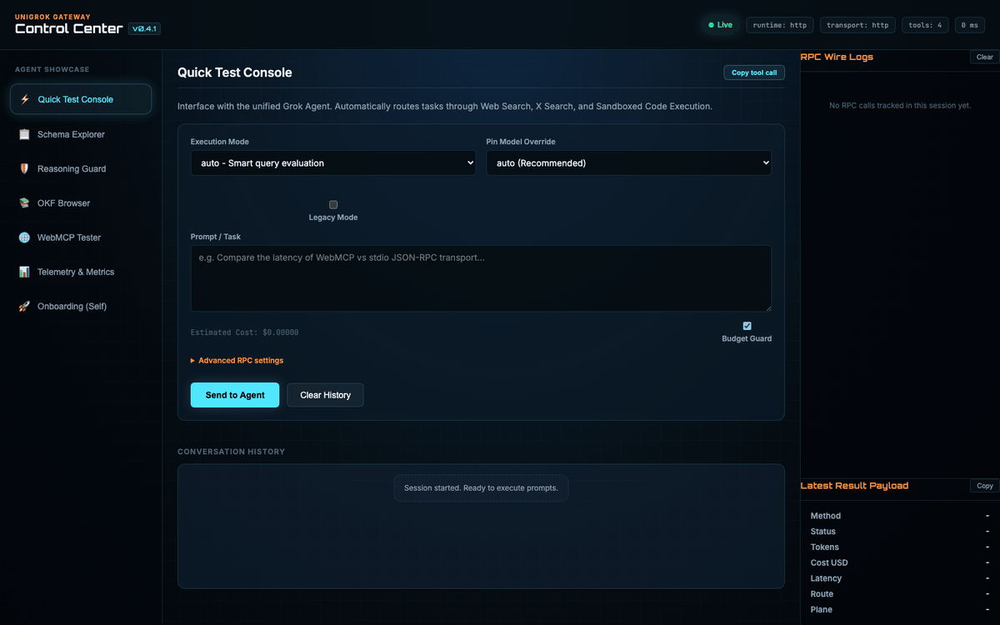
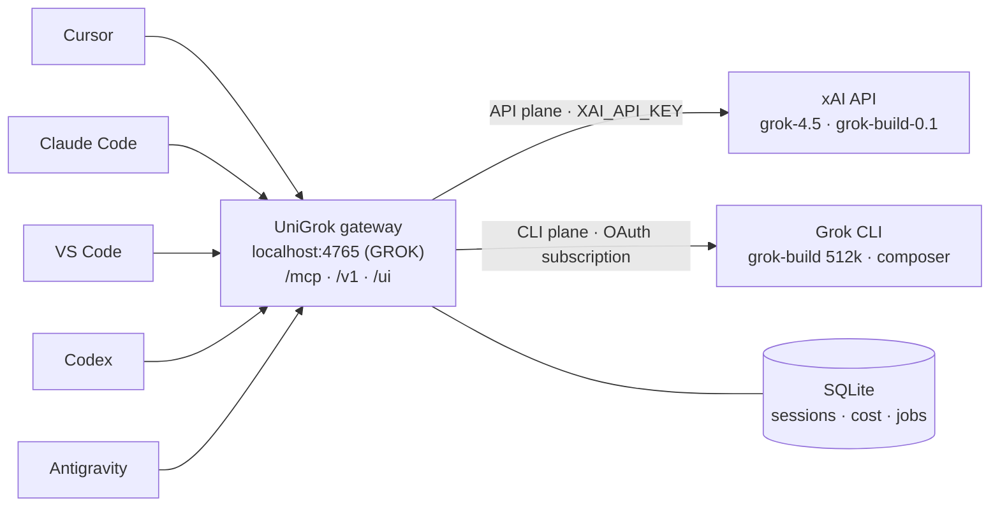

<div align="center">


[](https://github.com/djtelicloud/grok-mcp-server/actions)
[](https://github.com/djtelicloud/grok-mcp-server/releases)
[](pyproject.toml)
[](LICENSE)
[](https://modelcontextprotocol.io)
[](https://docs.x.ai/?utm_source=github&utm_medium=readme&utm_campaign=unigrok&utm_content=badge-docs)

[Quick Start](#quick-start) · [IDE Setup](#ide-setup) · [Tool Surface](#tool-surface) · [Architecture](#architecture) · [Security](#security-model)

</div>

# UniGrok · Grok MCP Server & Gateway

> **What is UniGrok?** One local Grok server that every coding agent on your
> machine shares — self-routing across xAI's API and the Grok CLI
> subscription, with per-call cost tracking, while your API key never leaves
> the server.



UniGrok is a local-first **Grok MCP server and gateway** for
[xAI's Grok models](https://docs.x.ai/?utm_source=github&utm_medium=readme&utm_campaign=unigrok&utm_content=intro-docs).
It runs once on your machine, keeps the xAI credential on the server side, and
lets Cursor, Claude Desktop, Claude Code, VS Code, Codex, Antigravity, and
other MCP clients share the same Grok agent over Streamable HTTP — with
dual-plane routing across the xAI API and the Grok CLI subscription, per-call
cost tracking, and a browser Control Center.


Current development release: **v0.5.0**.

Use it as:

- A shared multi-IDE Grok MCP server at `http://localhost:4765/mcp` (`4765` spells **GROK** on a phone keypad).
- An OpenAI-compatible local gateway for `unigrok-agent`.
- A structured agent harness with web search, X search, code execution, files,
  image/video generation, session memory, telemetry, and reflection.

## Quick Start

```bash
git clone https://github.com/djtelicloud/grok-mcp-server.git
cd grok-mcp-server
uv run python main.py init
```

The init command:

- copies `example.env` to `.env` when `.env` does not already exist;
- leaves an existing `.env` untouched;
- prints copy-paste configs for VS Code, Claude Desktop, Claude Code, and Codex;
- points every IDE at the shared HTTP endpoint instead of asking each IDE for
  the raw xAI key.

Edit `.env` and set your key — grab one from the
[xAI Console](https://console.x.ai/?utm_source=github&utm_medium=readme&utm_campaign=unigrok&utm_content=quickstart-get-key)
if you don't have one yet:

```bash
XAI_API_KEY=your_real_xai_api_key
```

Then start the shared service:

```bash
docker compose up --build -d
curl -s http://localhost:4765/healthz
```

Authenticate the independent CLI subscription plane once per machine:

```bash
docker compose run --rm grok-cli-auth
```

The helper uses xAI's device-code login and stores the refreshable OAuth state
in the dedicated `unigrok-cli-auth` Docker volume. It is service identity, not
project identity: never repeat this when switching repositories. Ordinary
startup is noninteractive and remains API-capable when CLI auth is absent.

This is a standalone, workspace-neutral service. The image runs its baked
application from `/app`, keeps mutable data in a Docker volume at `/state`, and
does **not** mount this repository or whichever project an IDE currently has
open. Register the endpoint globally once, then switch projects freely; those
projects need no `.agents`, `.codex`, `.grok`, or other UniGrok files.

When Grok needs project material, the calling IDE should send deliberately
selected excerpts, diffs, errors, or other context in `agent.workspace_context`.
UniGrok never guesses that MCP registration grants filesystem access.

Open the local Control Center:

```text
http://localhost:4765/ui/
```

## Install Script

For a guided local bootstrap:

```bash
./install.sh
```

It checks for `uv`, `git`, and Docker, syncs the Python environment, runs
`init`, and validates Docker Compose when Docker is available.

## IDE Setup

The default architecture is one shared Docker service:

```text
http://localhost:4765/mcp
```

Each IDE should send a stable `X-Client-ID` header so telemetry, sessions, and
budgets stay separated by caller.

### Cursor

With Cursor joining the xAI family (SpaceX's June 2026 agreement to acquire
Anysphere), it's the natural first-class Grok IDE — add UniGrok in 10 seconds.
Create or edit `.cursor/mcp.json` in your project root (or `~/.cursor/mcp.json`
globally) and paste:

```json
{
  "mcpServers": {
    "unigrok": {
      "url": "http://localhost:4765/mcp",
      "name": "UniGrok MCP Gateway",
      "description": "Shared Grok agent with live Control Center, cost tracking, reasoning guard, OKF + WebMCP self-discovery",
      "headers": { "X-Client-ID": "cursor" }
    }
  }
}
```

### VS Code

```json
{
  "servers": {
    "unigrok": {
      "type": "http",
      "url": "http://localhost:4765/mcp",
      "headers": { "X-Client-ID": "vscode" }
    }
  }
}
```

### Claude Desktop

Claude Desktop config-file servers are stdio commands, so bridge to HTTP with
`mcp-remote`:

```json
{
  "mcpServers": {
    "unigrok": {
      "command": "npx",
      "args": [
        "-y", "mcp-remote", "http://localhost:4765/mcp",
        "--header", "X-Client-ID: claude-desktop"
      ]
    }
  }
}
```

### Claude Code

```bash
claude mcp add --transport http unigrok http://localhost:4765/mcp \
  --header "X-Client-ID: claude-code"
```

### Codex

```toml
[mcp_servers.grok]
url = "http://localhost:4765/mcp"
http_headers = { "X-Client-ID" = "codex" }
```

If `UNIGROK_API_KEYS` is set in `.env`, also add
`Authorization: Bearer <token>` to each client config.

More detail, including Antigravity/Gemini notes, lives in
[docs/ide-setup.md](docs/ide-setup.md).

## Run Modes

Stdio MCP:

```bash
uv run python main.py
```

HTTP gateway:

```bash
uv run python main.py --http
```

Packaged console script:

```bash
uv run unigrok-mcp init
uv run unigrok-mcp --http
```

Supervised helper:

```bash
./grok-mcp-helper.sh init
./grok-mcp-helper.sh start
./grok-mcp-helper.sh status
```

## Tool Surface

Start with `agent`. It is the headline tool and should handle most nontrivial
requests.

Core tools:

- `agent`: auto-routed Grok agent with modes `auto`, `fast`, `reasoning`,
  `thinking`, and `research`.
- `grok_reflect`: focused structured critique for plans, code-review notes,
  outputs, and architecture decisions.
- `chat`: plain Grok chat with optional model pinning and session history.
- `chat_with_vision`: image analysis.
- `chat_with_files`: grounded answers over uploaded xAI files.
- `submit_research_job`, `get_research_job`, `list_research_jobs`: deferred
  xAI research jobs.
- `remember_fact`, `search_knowledge`, `forget_fact`, `distill_session`: local
  knowledge memory.
- `recall_workspace_memory`, `record_landed_outcome`,
  `explain_workspace_evidence`, `workspace_memory_status`: explicit,
  contributor-only, commit-anchored engineering evidence for agents developing
  UniGrok itself. Records require a verified `scripts/land` receipt; automatic
  prompt injection is off. These tools are not on the public HTTP service.
- `web_search`, `x_search`, `remote_code_execution`: xAI server-side tools.
- `read_local_file`, `list_project_files`: workspace inspection.
- `git_status`, `git_diff`, `git_log`, `git_show`: read-only Git context.
- `generate_image`, `generate_video`, `extend_video`: Grok Imagine media.

### Explainable model selection

`agent(model=None, mode="auto")` uses one deterministic, local-first selector:

- capability classes are `planning`, `coding`, `vision`, and `research`;
- planning cold-starts on `grok-4.5`, coding on `grok-build-0.1`, and research
  on the live Grok 4.20 multi-agent slug;
- explicit model pins and `UNIGROK_*_MODEL` overrides always win;
- the live catalog is cached for 15 minutes and a discovery failure uses the
  bundled model directory instead of blocking a request;
- fresh eval calibration is considered before local telemetry, but a peer
  needs mature evidence and a 15-point success-rate advantage to replace the
  stable default.

Every `AgentResult` includes a `routing` receipt, and new telemetry rows retain
that same prompt-free receipt. It explains the task feature bucket, route
class, candidate models, evidence source, selected model, pin source, and any
failover. The Control Center renders these receipts directly rather than
guessing a reason from aggregate metrics.

The public Streamable HTTP MCP endpoint intentionally exposes the unified
`agent` surface for IDE use. The full stdio server exposes the broader tool
set for local trusted workflows.

Workspace-memory operations are also available locally as
`unigrok-mcp memory status`, `unigrok-mcp memory sync`, and
`unigrok-mcp memory import`. The Git Notes ref is local provenance and is not
part of ordinary branch pushes.

The public HTTP surface stays intentionally small: `agent`, status, discovery,
and the disabled-by-default maintenance helper. In unrelated projects, call
`agent` normally and add `workspace_context` only when local project evidence
is needed.

## Architecture

UniGrok has three boundaries:

- Transport: stdio MCP, Streamable HTTP MCP, and an OpenAI-compatible `/v1`
  facade all route into the same agent harness.
- Model plane: API-backed Grok models are primary; authenticated local Grok CLI
  can serve CLI-plane models when available.
- Local state: SQLite stores sessions, telemetry, research jobs, task memory,
  distilled knowledge, and commit-anchored workspace evidence under the
  configured state directory.



Full design detail lives in [architecture.md](architecture.md).

UniGrok strips `XAI_API_KEY` from every CLI subprocess. This prevents a CLI
invocation from silently charging the API credential and makes the reported
CLI/API routing split a real credential and allowance boundary.

The Control Center usage ledger keeps those planes honest: xAI API requests
store the exact per-response billed cost; CLI subscription requests store local
counts, latency, success, model, and estimated tokens without inventing a
per-request dollar cost. Optional `XAI_MANAGEMENT_API_KEY` plus
`UNIGROK_XAI_TEAM_ID` enables a separately labeled, team-wide API billing
comparison. xAI does not expose SuperGrok subscription quota through that API,
so provider API totals are never added to CLI statistics.

Useful endpoints in HTTP mode:

- `GET /healthz`
- `GET /readyz`
- `GET /metrics`
- `GET /metrics?format=prometheus`
- `GET /v1/models`
- `POST /v1/chat/completions`
- `POST /mcp`

## WebMCP & OKF Discovery

UniGrok combines Google's **Open Knowledge Format (OKF)** with the experimental
**WebMCP** API currently published as a W3C Web Machine Learning Community
Group draft. WebMCP is not yet a W3C Standard.

### 1. OKF Knowledge Bundle
The directory `/docs/okf/` contains a fully self-describing documentation bundle for agents:
- `okf-manifest.json`: Lists index and topic documents.
- `index.md`: Main entrypoint for agent reading.
- Topic-specific files (e.g. `agent-tool.md`, `reasoning-guard.md`) detail tool schemas, inputs/outputs, model pinning, and telemetry budget controls.

### 2. WebMCP-Enabled Docs & Console
When running the HTTP gateway, visiting `http://localhost:4765/ui/` exposes browser-native WebMCP tools under `document.modelContext`.
Any agent visiting this page can automatically discover and call:
- `get_schema(tool_name)`: Returns the Pydantic JSON schema of a given UniGrok tool.
- `example_call(mode)`: Returns JSON templates/examples for different operational modes.
- `simulate_reasoning_guard`: Simulates checking if a model meets the required reasoning level.
- `fetch_okf_bundle`: Returns the metadata and file paths in the OKF bundle.

### 3. Pre-Visit Manifest Discovery
A project-specific experimental manifest is exposed at `/.well-known/webmcp`
so compatible agents and extensions can pre-discover the page's capabilities
without performing heavy DOM scrapes:
```bash
curl -s http://localhost:4765/.well-known/webmcp
```

### 4. Running a WebMCP-Compatible Browser or Bridge
To let an IDE agent call these experimental browser tools, use a browser build
or extension that exposes `document.modelContext`, and keep the target tab at
`http://localhost:4765/ui/` open.

## Security Model

- `XAI_API_KEY` belongs in the UniGrok server/container environment, not in
  each IDE client.
- `example.env` is a template only. The runtime loads `.env` when present and
  rejects the placeholder key.
- Docker publishes `127.0.0.1:4765` by default.
- Set `UNIGROK_API_KEYS` before exposing the gateway beyond loopback.
- Git write tools are disabled unless local runtime flags explicitly enable
  them.
- Container restart is disabled by default and should only be enabled for a
  trusted local process with Docker access.

See [SECURITY.md](SECURITY.md) for vulnerability reporting and deployment
guidance.

## Development

```bash
uv sync
uv run pytest
uv run python -m compileall -q src evals main.py
docker compose config
docker compose -f docker-compose.dev.yml config
```

Contributors who want live mounted source use the separate service on port
4766:

```bash
docker compose -f docker-compose.dev.yml up --build -d
```

That contributor endpoint conditionally adds the commit-anchored memory tools,
so repository-local IDE skills can recall and record verified landing evidence.
Those tools never appear on the stable service used by unrelated projects.

`scripts/land` may reconcile that contributor service after tests pass. It
never rebuilds or restarts the stable port-4765 service automatically.

### Optional Grok Dial Plan

UniGrok can expose memorable phoneword “speed-dial” ports without creating
extra services or databases. Enable the overlay with:

```bash
docker compose -f docker-compose.yml -f docker-compose.dials.yml up --build -d
```

| Dial | Phoneword | Default `agent` mode |
|---:|---|---|
| `2886` | AUTO | `auto` |
| `3278` | FAST | `fast` |
| `7327` | REAS | `reasoning` |
| `8465` | THNK | `thinking` |
| `7724` | RSCH | `research` |

Every dial reaches the same stable process, sessions, authentication, and
Control Center. The original `Host` port supplies a default only when the MCP
caller omits `mode`; an explicit tool argument always wins. Normal users should
register `4765` once. The dial overlay is an optional power-user interface.

Run the full local test suite before publishing changes. Offline evals can be
run with:

```bash
uv run python -m evals run --check-baseline
```

See [CONTRIBUTING.md](CONTRIBUTING.md) for contribution workflow and PR
expectations.

---

Built by [@DavidLJohnston](https://x.com/DavidLJohnston?utm_source=github&utm_medium=readme&utm_campaign=unigrok&utm_content=footer-author)
· Built for [Grok](https://grok.com/?utm_source=github&utm_medium=readme&utm_campaign=unigrok&utm_content=footer-grok)
· Powered by [xAI](https://x.ai/?utm_source=github&utm_medium=readme&utm_campaign=unigrok&utm_content=footer-brand)
· Follow [@xai](https://x.com/xai?utm_source=github&utm_medium=readme&utm_campaign=unigrok&utm_content=footer-x)
on X
