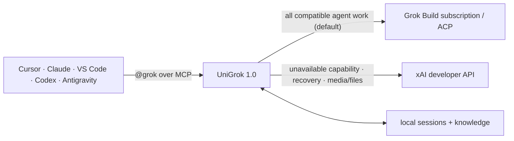
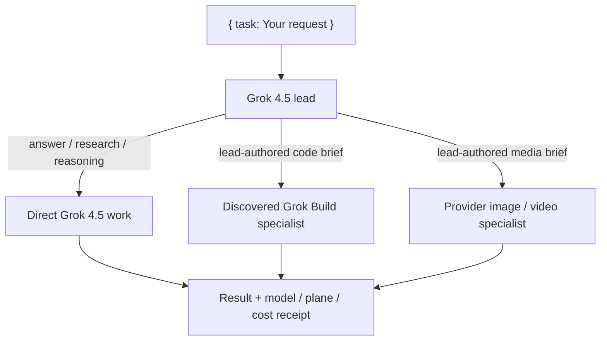

<div align="center">


[](https://github.com/djtelicloud/grok-mcp-server/actions)
[](pyproject.toml)
[](pyproject.toml)
[](LICENSE)
[](https://modelcontextprotocol.io)

</div>

# One Grok teammate. Every coding agent.

Install UniGrok once, connect every MCP-capable IDE, and use `@grok` from any project.
Your Grok login and optional xAI API key stay inside the local service—not scattered
through editor settings.

```text
http://localhost:4765/mcp
```

## What's new in 1.1

### Levels that scale with the job
Pass a `level` when you care how hard Grok thinks:

- `none` → `minimal` → `low` → `medium` → `high` → `xhigh` — one call, native Grok efforts
- `max` — a silent deep-reasoning harness under the hood
- `ultra` — a parallel hive: draft, persona votes, then a merge

Leave `level` unset and free router votes pick the rung for you. Hard tasks
auto-engage deeper reasoning; a typo fix never pays for a swarm.

### Receipts on every answer
Each reply reports plane, cost, route, and fallback. Hive runs break out
per-stage costs. Verified benchmark receipts ship with the gateway
(`benchmark_status`, `record_benchmark_result`).

### Jobs that survive restarts
Long tasks keep their results if the service restarts. Poll `agent_result`:
you get the finished answer, or an honest "lost, safe to retry" — never a
mystery hang.

### A gateway that optimizes itself, honestly
The dogfood loop lets the hive rewrite the gateway's own functions — but a
rewrite ships only when it is proven behavior-identical and measured >8%
faster, with no new imports and a bounded diff. Six functions shipped this
way (up to +52.8% measured). Sub-noise "wins" are rejected on principle.

## Why vibe coders use UniGrok

| | What you get |
|---|---|
| 🌐 | **Web research by default** in the main `agent` harness |
| 🧠 | **Named sessions and durable facts** that continue across IDEs |
| 🎨 | **Images, video, vision, files, X search, and web search** through xAI |
| 🔀 | **All agent tools available by default** with Build-first routing and receipts |
| 📊 | **Live benchmark dashboard** with latency, cost, callers, fallbacks, and breakers |
| 🔐 | **One local credential boundary** instead of keys in every project |
| 🧩 | **Portable project guidance** for rules, workflows, and skills |



## Get running in three minutes

You need [Docker Desktop](https://www.docker.com/products/docker-desktop/), Git, and at
least one Grok credential path:

- a Grok subscription with CLI device login, or
- an [xAI developer API key](https://console.x.ai/).

No Grok subscription or API key yet? You can also start with
[Cursor](https://cursor.com/referral?code=VJWHUMXIKTHG) (referral link) and come back
once you have a Grok credential.

### 1. Download and build

```bash
git clone https://github.com/djtelicloud/grok-mcp-server.git
cd grok-mcp-server
docker compose build
```

### 2. Connect Grok

For a Grok subscription, run the device-login flow once:

```bash
docker compose run --rm grok-cli-auth
```

For xAI API features, copy the example environment file and add your key locally:

```bash
cp example.env .env
```

Then edit `.env` and set `XAI_API_KEY`. Never paste that key into an IDE MCP file or
chat. You can configure either credential path or both.

### 3. Start UniGrok

```bash
docker compose up -d grok-mcp
curl --fail --silent http://localhost:4765/readyz
```

You are ready when the response says `"status":"ready"`.

Open the local Control Center at [http://localhost:4765/ui/](http://localhost:4765/ui/)
for live benchmark graphs, recent receipts, and circuit-breaker state.

## Connect your IDE

Paste this prompt into Cursor, Claude Code, VS Code, Codex, Antigravity, or another
MCP-capable coding agent:

```text
Configure an MCP server named grok for this machine.

- Transport: Streamable HTTP
- URL: http://localhost:4765/mcp
- Send a stable X-Client-ID header for this IDE, such as cursor or claude-code
- Never place XAI_API_KEY in the IDE configuration; credentials stay in UniGrok
- Reload MCP servers, then call grok_mcp_discover_self
- Use UniGrok's agent tool whenever I say @grok
```

The exact configuration filename varies by IDE, but every client connects to the same
local URL.

## Prove it in 60 seconds

Start a fresh conversation in any project and try:

```text
@grok research the best current approach for this feature, then give me a short plan.
```

```text
@grok remember that this project prefers small modules and tests before refactors.
```

```text
@grok continue session "my-project" and challenge the implementation plan.
```

The main `agent` tool makes web research, X search, and code execution available by
default. The calling agent must tell you these tools are available. You can disable them
with the optional `disable_tools` list.
Use `chat` only when you specifically want a stateless, tool-free answer.

## Two Grok planes, one simple entry point



- `agent` makes web, X search, and code tools available by default.
- The live Grok subscription default leads every request and writes specialist briefs.
- UniGrok selects models, planes, reasoning effort, and recovery automatically.
- When API is configured, `agent` uses one metered Grok 4.5 routing pass capped at 256
  output tokens. Direct work remains subscription-first; specialists and bounded recovery
  use API as needed.
- Use `disable_tools` only when you want a default tool unavailable to the agent.
- Supplying `XAI_API_KEY` is the service owner's opt-in to API use.
- Set `UNIGROK_ENABLE_METERED_API=false` for an immediate API kill switch.
- Responses include route and billing metadata; permanent deletion still requires an
  explicit confirmation parameter.

## Install once, keep projects clean

UniGrok is a global local service. It does not copy itself into every repository and it
never receives hidden access to your workspace.

On first use, UniGrok can offer an optional host-native integration pack through
`grok_mcp_onboard_client`:

```text
MCP connects → install globally? → IDE previews owned files → user approves → reload
                                      ↓
                         project guidance still overrides it
```

- **Global** is recommended: install a namespaced skill/plugin in the IDE's user scope.
- **Project** creates only a plan for project-local guidance.
- **Not now** and **Never ask again** are explicit choices.
- UniGrok never writes these files itself. The calling IDE uses its normal permissions,
  shows conflicts, and must not overwrite user-modified files blindly.

For a simple IDE call, let UniGrok choose the credential plane:

```json
{
  "task": "Reply exactly with: SEQUENTIAL_TEST_GROK"
}
```

`prompt` remains a compatibility alias for canonical `task`. The tools are available by
default, while UniGrok owns routing and model selection. The agent must disclose any actual
API use and explain the optional `disable_tools` list.

When you specifically want reusable project guidance instead, ask your coding agent:

```text
Initialize this project for portable agent collaboration. Preserve anything already
here, create only useful missing guidance, and follow UniGrok's project_onboarding
contract from grok_mcp_discover_self.
```

The current conventions are:

```text
AGENTS.md
.agents/rules/<rule-name>.md
.agents/workflows/<workflow-name>.md
.agents/skills/<skill-name>/SKILL.md
```

The calling IDE creates those files with its normal workspace permissions. Project
customizations take priority over the global UniGrok baseline. UniGrok provides the
instructions and templates but remains workspace-neutral.

## Safe by design

- The service binds to `127.0.0.1` by default.
- CLI OAuth and the xAI API key stay on the server side.
- The CLI runs in an empty disposable workspace with local file, shell, Git, edit,
  external MCP, memory, and subagent access disabled.
- Project text reaches Grok only when the calling IDE deliberately sends bounded
  `workspace_context`.
- Local sessions and remembered facts are redacted before SQLite storage.
- Media accepts public HTTPS URLs; uploads accept caller-supplied bytes, never local
  filesystem paths.

See [SECURITY.md](SECURITY.md) for the complete public runtime boundary.

## Go deeper when you need it

| I want to… | Read |
|---|---|
| See every tool and routing rule | [Technical reference](docs/reference.md) |
| Develop or acceptance-test UniGrok | [Development guide](docs/development.md) |
| Report a security issue | [Security policy](SECURITY.md) |

## License

[MIT](LICENSE)
