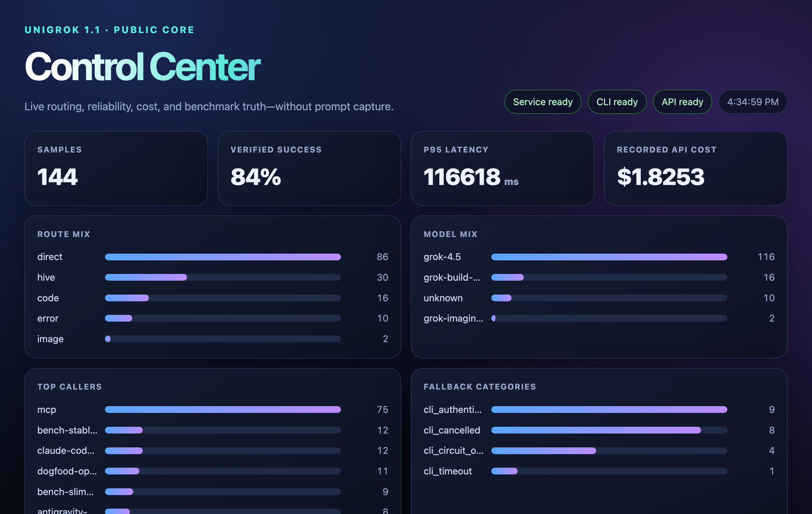
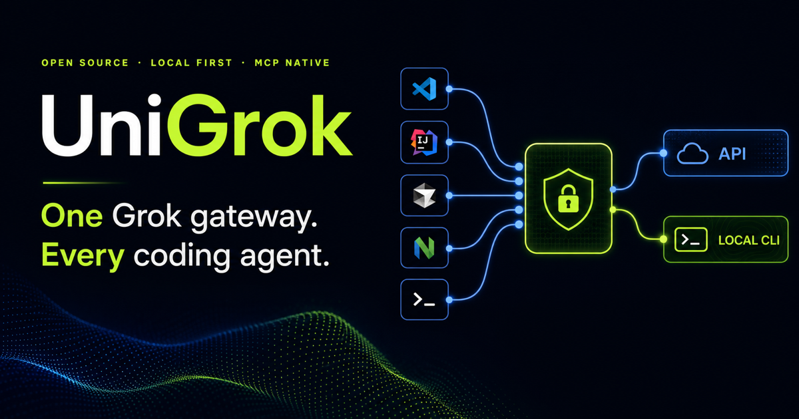
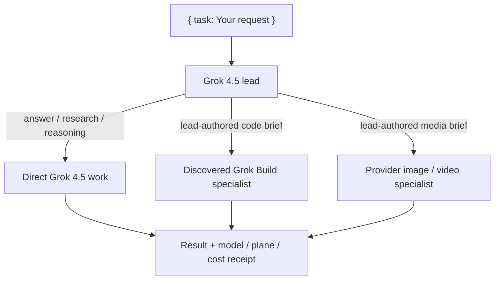

<div align="center">


[](https://github.com/djtelicloud/grok-mcp-server/actions)
[](pyproject.toml)
[](pyproject.toml)
[](LICENSE)
[](https://modelcontextprotocol.io)

</div>

# One Grok teammate. Every coding agent.

Install UniGrok once, connect every MCP-capable IDE, and use `@grok` from any project.
Your Grok login and optional xAI API key stay inside one local service — not scattered
through editor settings.

```text
http://localhost:4765/mcp
```

<div align="center">



<sub>The local Control Center at <code>http://localhost:4765/ui/</code> — live routing, cost, and benchmark receipts.</sub>

</div>

## Get running in three minutes

You need [Docker Desktop](https://www.docker.com/products/docker-desktop/) and Git, plus
Grok access. UniGrok runs on two Grok planes, in this order:

1. **Grok Build subscription** — the default, flat-rate plane. This is all you need.
2. **xAI developer API key** ([console.x.ai](https://console.x.ai/)) — optional, metered;
   adds vision, image/video, X search, and silent failover.

Set up plane 1 to get going; add plane 2 whenever you want the extras.

> In a hurry? `npx @djtelicloud/unigrok` prints these setup steps in your terminal.
> (A full launcher that runs the setup for you is planned; today UniGrok installs via
> Docker, below.)

### 1. Download and build

```bash
git clone https://github.com/djtelicloud/grok-mcp-server.git
cd grok-mcp-server
docker compose build
```

### 2. Connect Grok

**Grok subscription (recommended).** Log in once — the device-login runs inside the
container and stores the session in a private Docker volume:

```bash
docker compose run --rm grok-cli-auth
```

Want the Grok CLI on your own machine too? It is optional:

```bash
curl -fsSL https://x.ai/cli/install.sh | bash
```

**xAI API key (optional, metered).** Adds vision, image/video, and silent failover.
Copy the example env and add your key locally — never paste it into an IDE:

```bash
cp example.env .env   # then edit .env and set XAI_API_KEY
```

Either path works alone; set both if you want everything.

### 3. Start UniGrok

```bash
docker compose up -d grok-mcp
curl --fail --silent http://localhost:4765/readyz
```

You are ready when the response says `"status":"ready"`.

> New to Grok-powered coding? [Cursor](https://cursor.com/referral?code=VJWHUMXIKTHG)
> (referral link) is an easy on-ramp — set up a Grok plane above whenever you're ready.

## Connect your IDE

Paste this into Cursor, Claude Code, VS Code, Codex, Antigravity, or any MCP-capable
coding agent:

```text
Configure an MCP server named grok for this machine.

- Transport: Streamable HTTP
- URL: http://localhost:4765/mcp
- Send a stable X-Client-ID header for this IDE, such as cursor or claude-code
- Never place XAI_API_KEY in the IDE configuration; credentials stay in UniGrok
- Reload MCP servers, then call grok_mcp_discover_self
- Use UniGrok's agent tool whenever I say @grok
```

The config filename varies by IDE, but every client connects to the same local URL.

## Try it in 60 seconds

Start a fresh conversation in any project and try:

```text
@grok research the best current approach for this feature, then give me a short plan.
```

```text
@grok remember that this project prefers small modules and tests before refactors.
```

```text
@grok continue session "my-project" and challenge the implementation plan.
```

That is it — type `@grok`, and UniGrok picks the route, model, effort, and recovery for
you. Every answer comes back with a plane and cost receipt.

## Why vibe coders use UniGrok

| | What you get |
|---|---|
| ⚡ | **One tool, `agent`** — say what you want; routing, effort, and recovery are automatic |
| 🎚️ | **Levels that scale** — from a quick answer up to a parallel review swarm, picked for you |
| 💸 | **Free by default** — your Grok subscription is flat-rate; an API key is optional |
| 🧾 | **Receipts on every answer** — plane, cost, route, and fallback, so nothing is hidden |
| 🧠 | **Sessions and memory** — named sessions and facts you control, kept locally |
| 🎨 | **Images, video, vision, files, web + X search** when you add an API key |
| 🤖 | **PR reviews on comment** — a maintainer types `@grok review` on a pull request and a read-only Grok review answers |
| 🔐 | **One credential boundary** — keys live in UniGrok, not in every project |

<div align="center">



</div>

## What's new in 1.1

### Levels that scale with the job
Pass a `level` when you care how hard Grok thinks:

- `none` → `minimal` → `low` → `medium` → `high` → `xhigh` — one call, native Grok efforts
- `max` — a silent deep-reasoning harness under the hood
- `ultra` — a parallel hive: draft, persona votes, then a merge

Leave `level` unset and free router votes pick the rung for you. Hard tasks
auto-engage deeper reasoning; a typo fix never pays for a swarm.

### Jobs that survive restarts
Long tasks keep their results if the service restarts. Poll `agent_result`: you get the
finished answer, or an honest "lost, safe to retry" — never a mystery hang.

### A gateway that optimizes itself, honestly
The dogfood loop lets the hive rewrite the gateway's own functions — but a rewrite ships
only when it is proven behavior-identical and measured >8% faster, with no new imports
and a bounded diff. Six functions shipped this way (up to +52.8% measured). Sub-noise
"wins" are rejected on principle.

## Two Grok planes, one simple entry point



- `agent` makes web, X search, and code tools available by default.
- The live Grok subscription default leads every request and writes specialist briefs.
- UniGrok selects models, planes, reasoning effort, and recovery automatically.
- When API is configured, `agent` uses one metered Grok 4.5 routing pass capped at 256
  output tokens. Direct work remains subscription-first; specialists and bounded recovery
  use API as needed.
- Supplying `XAI_API_KEY` is the service owner's opt-in to API use.
- Set `UNIGROK_ENABLE_METERED_API=false` for an immediate API kill switch.

## Install once, keep projects clean

UniGrok is a global local service. It does not copy itself into every repository and it
never receives hidden access to your workspace.

On first use, UniGrok can offer an optional host-native integration pack through
`grok_mcp_onboard_client`:

```text
MCP connects → install globally? → IDE previews owned files → user approves → reload
                                      ↓
                         project guidance still overrides it
```

- **Global** is recommended: install a namespaced skill/plugin in the IDE's user scope.
- **Project** creates only a plan for project-local guidance.
- **Not now** and **Never ask again** are explicit choices.
- UniGrok never writes these files itself. The calling IDE uses its normal permissions,
  shows conflicts, and must not overwrite user-modified files blindly.

The current project-guidance conventions are:

```text
AGENTS.md
.agents/rules/<rule-name>.md
.agents/workflows/<workflow-name>.md
.agents/skills/<skill-name>/SKILL.md
```

Project customizations take priority over the global UniGrok baseline. UniGrok provides
the instructions and templates but remains workspace-neutral.

## Safe by design

- The service binds to `127.0.0.1` by default.
- CLI OAuth and the xAI API key stay on the server side.
- The CLI runs in an empty disposable workspace with local file, shell, Git, edit,
  external MCP, memory, and subagent access disabled.
- Project text reaches Grok only when the calling IDE deliberately sends bounded
  `workspace_context`.
- Local sessions and remembered facts are redacted before SQLite storage.
- Media accepts public HTTPS URLs; uploads accept caller-supplied bytes, never local
  filesystem paths.
- Ask for an image or video without an API key and UniGrok says so plainly — it never
  fabricates a media link.

See [SECURITY.md](SECURITY.md) for the complete public runtime boundary.

## Go deeper when you need it

| I want to… | Read |
|---|---|
| See every tool and routing rule | [Technical reference](docs/reference.md) |
| Drive `agent` from an IDE agent | [Technical reference](docs/reference.md#how-an-ide-agent-should-drive-agent) |
| Develop or acceptance-test UniGrok | [Development guide](docs/development.md) |
| Report a security issue | [Security policy](SECURITY.md) |

## License

[MIT](LICENSE)
