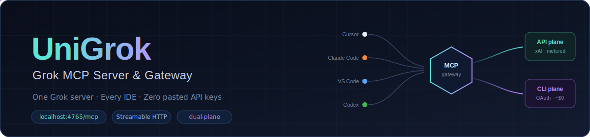

<div align="center">



[](https://github.com/djtelicloud/grok-mcp-server/actions)
[](https://github.com/djtelicloud/grok-mcp-server/releases)
[](pyproject.toml)
[](LICENSE)
[](https://modelcontextprotocol.io)
[](https://docs.x.ai/?utm_source=github&utm_medium=readme&utm_campaign=unigrok&utm_content=badge-docs)

</div>

# UniGrok · one Grok gateway for every coding agent

> Run Grok once on your machine. Point every IDE agent at it. Keep the xAI
> credential on the server — never in each editor.

UniGrok is a local-first [MCP](https://modelcontextprotocol.io) gateway for
[xAI Grok](https://docs.x.ai/). Cursor, Claude, VS Code, Codex, Antigravity, and
other MCP clients share **one** Streamable HTTP endpoint:

```text
http://localhost:4765/mcp
```

It routes across the **xAI developer API** (metered) and the **SuperGrok CLI
subscription** (when authenticated), and returns the answer under `response`
with route / plane / cost metadata.

Current release: **v0.6.0**.

---

## 1. What you get

- Shared `@grok` / `agent` tool for every IDE on your laptop
- Server-side credentials (API key and/or CLI OAuth)
- Optional local Core UI for status: `http://localhost:4765/ui/`
- A habit you can opt into: critique Implementation Plans with Grok before the
  user sees them

Your other projects do **not** need UniGrok repo folders, contributor trees, or
special mounts.

## 2. Prerequisites

- Git
- [`uv`](https://docs.astral.sh/uv/getting-started/installation/)
- An MCP-capable IDE
- At least one Grok credential path:
  - **xAI API key** from [console.x.ai](https://console.x.ai/), **or**
  - **SuperGrok / Grok CLI** device login (subscription)

Docker Desktop is the current packaging path for the shared service. Treat it as
how UniGrok runs on your machine — not as “you are a Docker developer.”

## 3. Run the gateway

```bash
git clone https://github.com/djtelicloud/grok-mcp-server.git
cd grok-mcp-server
uv run python main.py init
```

`init` creates `.env` from the template (if missing) and prints IDE MCP snippets
pointed at `http://localhost:4765/mcp`.

**API path:** set in `.env` (server only):

```bash
XAI_API_KEY=your_real_xai_api_key
```

**CLI subscription path** (after the service image is available):

```bash
docker compose up --build -d
docker compose run --rm grok-cli-auth
```

**Start (or refresh) the service:**

```bash
docker compose up --build -d
curl --fail -s http://localhost:4765/healthz
curl --fail -s http://localhost:4765/readyz
```

You are ready when `/readyz` reports `"status":"ready"`. `/healthz` only proves
the process is up.

## 4. Connect your IDE (paste this to your agent)

Copy the block for your IDE from the `init` output, or paste this prompt to your
local coding agent:

```text
Configure UniGrok MCP for this machine:
- Streamable HTTP URL: http://localhost:4765/mcp
- Send a stable X-Client-ID header for this IDE (e.g. cursor, claude-code, vscode, codex)
- Never put XAI_API_KEY in IDE MCP settings; credentials stay in UniGrok's server .env
- After connecting, call tools/list and grok_mcp_discover_self
- Prefer the UniGrok agent tool when I say @grok or want a second opinion
- When I ask for a multi-step Implementation Plan, get a UniGrok second opinion
  (agent mode thinking or reasoning) and improve the plan before showing it —
  only if I want that habit; do not silently spend metered API credits
- Do not invent a second MCP port, Forge, or land workflow for ordinary use
```

Detailed multi-IDE notes: [docs/ide-setup.md](docs/ide-setup.md) (public path
only; contributor dual-runtime detail lives in CONTRIBUTING).

## 5. Prove it in 60 seconds

1. Restart the IDE MCP client.
2. Ask: “Call UniGrok discover_self and tell me which credential planes are ready.”
3. Ask for a small plan, then: “Get a UniGrok second opinion on that plan before
   you show me the Implementation Plan.”

Optional status UI (this machine only): open
[http://localhost:4765/ui/](http://localhost:4765/ui/).

## 6. Security (short)

1. Keep `XAI_API_KEY` and CLI OAuth on the UniGrok service — never in IDE configs.
2. API plane is metered; CLI subscription cost is not exposed by the provider —
   UniGrok only tracks local CLI activity.
3. Stable UniGrok does not browse your project unless you pass
   `workspace_context`.
4. Loopback Core UI is for the machine owner; it is not a public multi-user
   console.
5. Do not paste secrets into chat.

## 7. Project site (optional)

The public site at [https://grokmcp.org](https://grokmcp.org) is **bound to the
existing project** repository. It is not an idless installer template. For the
optional contributor control surface, **GitHub App OAuth establishes identity**
and each privileged request performs a **fresh installation-token lookup** of
repo role; a **Sites rollback fallback** remains only for the legacy identity
binding path. That control plane does not replace local UniGrok MCP on
`localhost:4765`, and it never holds your xAI key.

## 8. Next steps

| I want… | Go here |
|---|---|
| More IDE examples | [docs/ide-setup.md](docs/ide-setup.md) |
| Architecture | [architecture.md](architecture.md) |
| Security reporting | [SECURITY.md](SECURITY.md) |
| **Contribute to UniGrok itself** | [CONTRIBUTING.md](CONTRIBUTING.md) |
| Project site | [https://grokmcp.org](https://grokmcp.org) |

Contributors and admins: dual-runtime Forge, landing, Swarm, and insider Console
behavior are documented only in [CONTRIBUTING.md](CONTRIBUTING.md) — not required
for ordinary use.

## License

[MIT](LICENSE)
