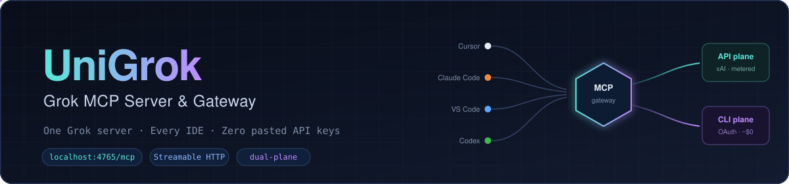
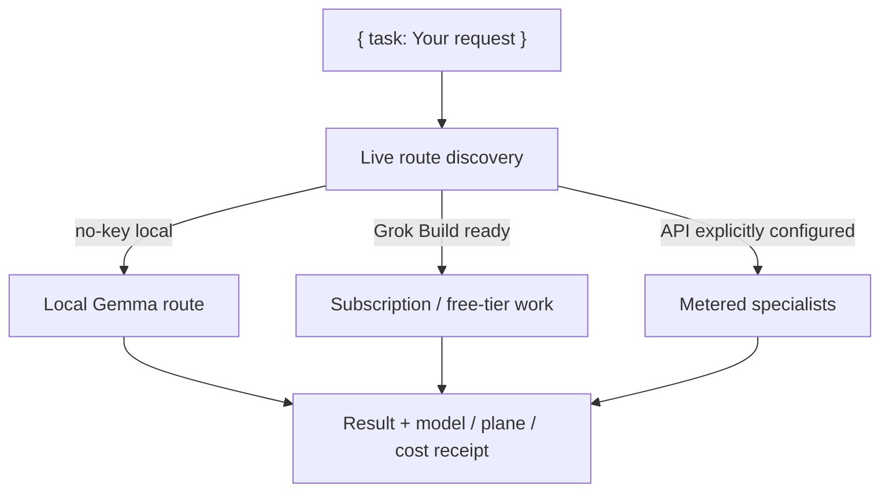

<div align="center">



[](https://github.com/djtelicloud/grok-mcp-server/actions)
[](pyproject.toml)
[](pyproject.toml)
[](LICENSE)
[](https://modelcontextprotocol.io)

</div>

# One Grok teammate. Every coding agent.

Install UniGrok Core once, connect every MCP-capable IDE, and use `@grok` from any
project. Start with a no-key local model, a Grok Build login, an optional xAI API key,
or any combination of those routes.

```text
http://localhost:4765/mcp
```

This clone, the commands below, and the service they start on port `4765` are the
complete public offering. Private provider coordination and operator infrastructure are
not part of UniGrok Core.

## Get running in three minutes

You need [Docker Desktop](https://www.docker.com/products/docker-desktop/) and Git.
Choose at least one inference route:

1. **No-key local model** — Docker Model Runner plus a compatible local model.
2. **Grok Build login** — subscription or available free-tier CLI access.
3. **xAI developer API key** ([console.x.ai](https://console.x.ai/)) — optional and
   metered; adds provider-hosted files, media, search, and code execution.

UniGrok discovers the routes that are actually ready. A local-only installation stays
local and reports unsupported cloud-only capabilities honestly.

> In a hurry? `npx @djtelicloud/unigrok` prints these setup steps in your terminal.
> (A full launcher that runs the setup for you is planned; today UniGrok installs via
> Docker, below.)

### 1. Download and build

```bash
git clone https://github.com/djtelicloud/grok-mcp-server.git
cd grok-mcp-server
docker compose build
```

### 2. Choose an inference route

**No paid key or CLI login.** Enable Docker Model Runner, pull a pinned Gemma model,
and start it locally:

```bash
docker desktop enable model-runner
docker model pull ai/gemma3:4B-Q4_K_M
docker model run --detach ai/gemma3:4B-Q4_K_M
```

This route uses Docker Desktop's private container endpoint and no API key. Leave
host-side TCP support disabled: Docker Model Runner's API is unauthenticated, and
enabling `--tcp` can expose it beyond localhost on some installations. The pinned
model supplies bounded local text assistance; UniGrok does not pretend that it
provides cloud search, media generation, or a separately certified code role.

**Grok Build.** Log in once — the device login runs inside the container and stores
the session in a private Docker volume:

```bash
docker compose run --rm grok-cli-auth
```

Want the Grok CLI on your own machine too? It is optional:

```bash
curl -fsSL https://x.ai/cli/install.sh | bash
```

**xAI API key (optional, metered).** Adds provider-hosted files, vision, image/video,
search, code execution, and bounded recovery. Keep the key in the service environment
only — never in IDE MCP JSON:

```bash
export XAI_API_KEY='<your key>'
```

Any one route works alone. Configure more than one if you want bounded, receipted
recovery between compatible routes.

### 3. Start UniGrok

```bash
docker compose up -d grok-mcp
curl --fail --silent http://localhost:4765/readyz
```

You are ready when the response says `"status":"ready"`.

> New to Grok-powered coding? [Cursor](https://cursor.com/referral?code=VJWHUMXIKTHG)
> (referral link) is an easy on-ramp — set up a Grok plane above whenever you're ready.

## Connect your IDE

Paste this into Cursor, Claude Code, VS Code, Codex, Antigravity, or any MCP-capable
coding agent:

```text
Configure an MCP server named grok for this machine.

- Transport: Streamable HTTP
- URL: http://localhost:4765/mcp
- Send a stable X-Client-ID header for this IDE, such as cursor or claude-code
- Never place XAI_API_KEY in the IDE configuration; credentials stay in UniGrok
- Reload MCP servers, then call grok_mcp_discover_self
- Use UniGrok's agent tool whenever I say @grok
```

The config filename varies by IDE, but every client connects to the same local URL.

## Try it in 60 seconds

Start a fresh conversation in any project and try:

```text
@grok research the best current approach for this feature, then give me a short plan.
```

```text
@grok remember that this project prefers small modules and tests before refactors.
```

```text
@grok continue session "my-project" and challenge the implementation plan.
```

That is it — type `@grok`, and UniGrok picks the route, model, effort, and recovery for
you. Every answer comes back with a plane and cost receipt.

## Why vibe coders use UniGrok

| | What you get |
|---|---|
| ⚡ | **One tool, `agent`** — say what you want; routing, effort, and recovery are automatic |
| 🎚️ | **Levels that scale** — from a quick answer up to a parallel review swarm, picked for you |
| 💸 | **A real zero-key route** — a compatible Docker Model Runner model can serve local text without a paid provider key |
| 🧾 | **Receipts on every answer** — plane, cost, route, and fallback, so nothing is hidden |
| 🧠 | **Sessions and memory** — named sessions and facts you control, kept locally |
| 🎨 | **Images, video, vision, files, web + X search** when you add an API key |
| 🤖 | **PR reviews on comment** — a maintainer types `@grok review` on a pull request and a read-only Grok review answers |
| 🔐 | **One credential boundary** — keys live in UniGrok, not in every project |

## What's new in 1.1

### Levels that scale with the job
Pass a `level` when you care how hard Grok thinks:

- `none` → `minimal` → `low` → `medium` → `high` → `xhigh` — one call, native Grok efforts
- `max` — a silent deep-reasoning harness under the hood
- `ultra` — a parallel hive: draft, persona votes, then a merge

Leave `level` unset and UniGrok picks the rung for you. In local Compose, unclear tasks
use CLI-first router votes. Hard tasks auto-engage deeper reasoning; a typo fix never
pays for a swarm. Receipts expose
any bounded API fallback used when those votes are inconclusive.

### Jobs that survive restarts
On persistent local Compose, Mission V2 tasks keep their mission ledger across service restarts and resume with the
same `continue_token`; terminal reattach returns the durable winner without rerunning
the model. Generic durable jobs keep results recorded before restart. If a generic job
was interrupted before a result was recorded, it returns `lost`: the provider outcome
is unknown, so inspect state before retrying a metered or mutating operation.

## Three routes, one simple entry point

The normal `@grok` service discovers a compatible local runtime automatically. It
prefers a ready Grok Build login, can use a service-owned API key when authorized, and
uses the local route when remote routes are unavailable. See
[Local model routes](docs/offline-local-helper.md) for the integrated route and the
optional named helper.


```mermaid
flowchart TD
    T["{ task: Your request }"] --> R["Live route discovery"]
    R -->|"no-key local"| G["Local Gemma route"]
    R -->|"Grok Build ready"| D["Subscription / free-tier work"]
    R -->|"API explicitly configured"| M["Metered specialists"]
    G --> O["Result + model / plane / cost receipt"]
    D --> O
    M --> O
```

- `agent` makes web, X search, and code tools available when the selected route supports
  them.
- A ready Grok Build login remains the preferred remote lead.
- With no remote credential, a compatible local runtime provides bounded local text help
  at `cost_usd: 0`.
- UniGrok selects models, planes, reasoning effort, and recovery automatically.
- Clear tasks route heuristically; otherwise three bounded, CLI-first intent votes select
  shape. If too few votes parse, an API semantic fallback may run (256 output tokens by
  default, configurable from 64–1024). Direct work remains subscription-first;
  specialists and bounded recovery use API as needed.
- Supplying `XAI_API_KEY` is the service owner's opt-in to API use.
- Set `UNIGROK_ENABLE_METERED_API=false` for an immediate API kill switch.

## Install once, keep projects clean

UniGrok is a global local service. It does not copy itself into every repository and it
never receives hidden access to your workspace.

On first use, UniGrok can offer an optional host-native integration pack through
`grok_mcp_onboard_client`:

```text
MCP connects → install globally? → IDE previews owned files → user approves → reload
                                      ↓
                         project guidance still overrides it
```

- **Global** is recommended: install a namespaced skill/plugin in the IDE's user scope.
- **Project** creates only a plan for project-local guidance.
- **Not now** and **Never ask again** are explicit choices.
- UniGrok never writes these files itself. The calling IDE uses its normal permissions,
  shows conflicts, and must not overwrite user-modified files blindly.

The current project-guidance conventions are:

```text
AGENTS.md
.agents/rules/<rule-name>.md
.agents/workflows/<workflow-name>.md
.agents/skills/<skill-name>/SKILL.md
```

Project customizations take priority over the global UniGrok baseline. UniGrok provides
the instructions and templates but remains workspace-neutral.

## Safe by design

- The service binds to `127.0.0.1` by default.
- CLI OAuth and the xAI API key stay on the server side.
- The CLI runs in an empty disposable workspace with local file, shell, Git, edit,
  external MCP, memory, and subagent access disabled.
- Project text reaches Grok only when the calling IDE deliberately sends bounded
  `workspace_context`.
- Local durable payloads are recursively secret-redacted before SQLite storage. Mission
  answer projections are additionally capped at 100 KB.
- Named-session turns and context packs are written only after Mission V2 CommitDone;
  rejected drafts never enter session memory, and repeated terminal reattach is idempotent.
- In persistent local Compose, terminal runtime rows default to 24-hour retention
  (configurable 1–720 hours), while named sessions and remembered facts persist until
  explicitly deleted. Hosted state is instance-local as documented below.
- Media accepts public HTTPS URLs; uploads accept caller-supplied bytes, never local
  filesystem paths.
- Ask for an image or video without an API key and UniGrok says so plainly — it never
  fabricates a media link.

Optional local hardening (see [SECURITY.md](SECURITY.md) and `example.env`):

- `UNIGROK_LOCAL_MCP_TOKEN` / `_SHA256` — require Bearer auth on `/mcp` while keeping health probes public
- `UNIGROK_LOCAL_DAILY_BUDGET_USD` — fail-closed aggregate daily metered spend ceiling
- `grok_mcp_onboard_client(safe_mode=true)` — install plan without auto-approve hooks / whole-server trust

See [SECURITY.md](SECURITY.md) for the complete public runtime boundary and local IDE threat model.

## Go deeper when you need it

| I want to… | Read |
|---|---|
| Understand the service and state machines | [Public architecture](docs/architecture.md) |
| See every tool and routing rule | [Technical reference](docs/reference.md) |
| Use the integrated local route or named local helper | [Local model routes](docs/offline-local-helper.md) |
| Drive `agent` from an IDE agent | [Technical reference](docs/reference.md#how-an-ide-agent-should-drive-agent) |
| Develop or acceptance-test UniGrok | [Development guide](docs/development.md) |
| See what has limited soak and how to report a miss | [Known limits](docs/known-limits.md) |
| See what changed between versions | [Changelog](CHANGELOG.md) |
| Report a security issue | [Security policy](SECURITY.md) |

## License

[MIT](LICENSE)
