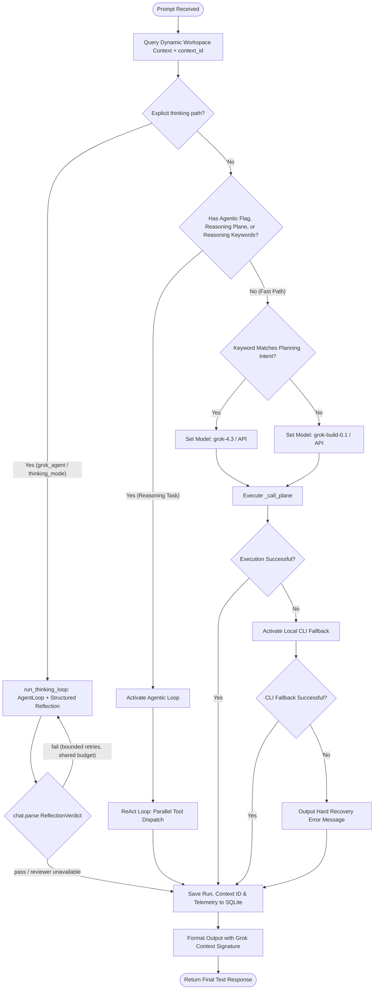

# Architecture — UniGrok · Grok MCP Server & Gateway

This document is the production-grade architectural specification of **UniGrok**, a local-first **Grok MCP (Model Context Protocol) server and gateway**. It has been reviewed and refined in collaboration with the live Grok API — the project dogfoods its own `agent` tool for design reviews.

---

## 1. System Overview & Core Goals

UniGrok is a Python implementation built on the `FastMCP` framework. It runs once on a developer's machine as a shared local gateway: every MCP client (Claude Code, Claude Desktop, VS Code, Codex, Antigravity) connects to the same endpoint, the xAI credential stays server-side, and requests self-route across two Grok planes — the metered xAI API and the Grok CLI subscription. It bridges cloud APIs with local execution fallbacks and workspace context sensing.

```
                                  +----------------------------------+
                                  |      MCP IDE / Agent Hosts       |
                                  | (Claude Code, VS Code, Codex,    |
                                  |  Claude Desktop, Antigravity)    |
                                  +----------------------------------+
                                                   |
                                     JSON-RPC over Stdio/HTTP (MCP)
                                                   v
+───────────────────────────────────────────────────────────────────────────────────────────────────+
|                                  UniGrok MCP Server (FastMCP)                                     |
|                                                                                                   |
|  +─────────────────────────+  +─────────────────────────+  +───────────────────────────────────+  |
|  |     chats.py Tools      |  |     media.py Tools      |  |         system.py Tools           |  |
|  |  - chat / agentic_chat   |  |  - generate_image / video|  |  - status / file upload & reads   |  |
|  |  - grok_agent / vision  |  |  - grok_imagine         |  |  - code_executor / web & X search |  |
|  +─────────────────────────+  +─────────────────────────+  +───────────────────────────────────+  |
|                                              |                                                    |
|                                    Internal Tool Dispatch                                         |
|                                              v                                                    |
|  +─────────────────────────────────────────────────────────────────────────────────────────────+  |
|  |                                  utils.py Orchestrate                                        |
|  |                                                                                             |  |
|  |  +───────────────────────────────────────────────────────────────────────────────────────+  |  |
|  |  |  Workspace Context Engine (Git status tracking, active file parsing, system dynamic)  |  |  |
|  |  +───────────────────────────────────────────────────────────────────────────────────────+  |  |
|  |                                           |                                                  |  |
|  |                     +─────────────────────+─────────────────────+                            |  |
|  |                     | (Default / Thinking)                      | (Fast / Kill-switch)       |  |
|  |                     v                                           v                            |  |
|  |        +─────────────────────────+                 +──────────────────────────+              |  |
|  |        |      AgentLoop (ReAct)  |                 |  Fast Path (toolless)    |              |  |
|  |        |  Tier 1 Cloud Tools     |                 +──────────────────────────+              |  |
|  |        |  Tier 2 Local Registry  |                              |                            |  |
|  |        +─────────────────────────+                              v                            |  |
|  |                     |                                    Plane Dispatcher                    |  |
|  |                     v                                           |                            |  |
|  |        +─────────────────────────+            +─────────────────+─────────────────+          |  |
|  |        | Structured Reflection   |            | (API Cloud Plane) | (CLI Local Plane) |          |  |
|  |        | chat.parse(Verdict)     |            v                   v                   |          |
|  |        +─────────────────────────+       xAI Cloud SDK     Local grok CLI binary     |          |
|  |                     |                     (https-tls)       (grok-composer-fast)      |          |
|  +─────────-───────────┼─────────────────────────┼───────────────────┼───────────────────┼──────+  |
|                        |                         |                   |                   |          |
+────────────────────────┼─────────────────────────┼───────────────────┼───────────────────┼──────────+
                         |                         |                   |                   |
                         v                         v                   v                   v
            +─────────────────────────+   +─────────────────+   +──────────────+   +──────────────+
            | SQLite Session Store    |   |  xAI Developer  |   | Local System |   | X / Web /    |
            | (Messages & Telemetry)  |   |  Cloud Endpoint |   | Filesystem   |   | Sandbox APIs |
            +─────────────────────────+   +─────────────────+   +──────────────+   +──────────────+
```

### Guiding Principles:
* **Local dual-plane execution**: The server utilizes a Cloud API Plane (via `xai-sdk`) and a Local CLI Plane (via the native `grok` command-line tool) to ensure resilience against network failures or credential issues.
* **Context-awareness**: The workspace state (active file, Git diffs, etc.) is sensed dynamically to ground generation.
* **Durable local storage**: A concurrent SQLite-backed database maintains telemetry, sessions, and messages.

---

## 2. Grok Architecture Audit & Critique

During the collaborative review, `grok-4.3` identified several structural bottlenecks and recommended key pattern shifts:

### 2.1 SQLite Concurrency & Blocking
* **Critique**: The database model previously ran a synchronous connection store. Under high workloads (such as 15+ concurrent writes), SQLite's single-writer limitation combined with Python's GIL risked head-of-line blocking and busy timeouts.
* **Implemented Solution**: Migrated `GrokSessionStore` to an async-native driver (`aiosqlite`) using a persistent connection protected by an asynchronous lock (`asyncio.Lock`), running in WAL mode with normal synchronous durability and an explicit `PRAGMA busy_timeout=30000`.
* **Automatic Reconnection & Vitality Checks**: Implemented double-checked connection health checks. Every async operation queries `SELECT 1` on the active connection; if a connection goes stale or drops, the system automatically closes the dead handler and spawns a fresh `aiosqlite` connection cleanly.
* **WAL Flush on Shutdown**: During server lifespan shutdown or explicit close, `PRAGMA wal_checkpoint(TRUNCATE);` is executed to flush all active transaction journals from memory and merge them back into the `.db` file, preventing corruption and ensuring clean exit states.

### 2.2 Asyncio Loop Event-Starvation
* **Critique**: The `AgentLoop` dispatches Tier 2 local tools in parallel. However, calling blocking functions (e.g. file writes, heavy image processing) inside the event loop risks event loop starvation.
* **Refined Pattern**: Enforce execution boundaries. Move all synchronous Tier 2 file I/O operations into `ThreadPoolExecutor` or `ProcessPoolExecutor` scopes using `asyncio.to_thread`.

### 2.3 CLI vs. API Context Drift
* **Critique**: `get_dynamic_context()` reads Git state and active file contents on command initiation. If context changes during multi-turn ReAct loops, state drift occurs.
* **Implemented Pattern**: **Versioned Context Snapshots**. Each fresh dynamic context fetch generates a unique `context_id` combining timestamp, `git_sha`, file-content hash, and rendered-context hash. The `context_id` is persisted in telemetry rows and assistant message metadata for traceability.

### 2.4 Token Estimation Heuristics
* **Critique**: The token limits are checked using string-length estimates (`max_obs_chars = max_tokens * 4`), which can cause context window overflows on long reasoning trace files.
* **Implemented Pattern**: Integrate token-aware observation trimming using `tiktoken` in `AgentLoop`, with character-limit fallback when token encoding is unavailable.

---

## 3. High-Level Execution Flow




---

## 4. Component Specifications

### 4.1 PathResolver & Workspace Ingestion
* `PathResolver` maps absolute file structures across the host machine, resolving the paths for `uv`, custom Python libraries, and local database storage.
* `get_dynamic_context(prompt=...)` monitors git changes using `git status --porcelain`, falls back to recent project files, reads a bounded code excerpt, and emits a versioned `context_id` for telemetry and message metadata. When the caller passes the prompt, ALL candidate modified/recent files are ranked by `_task_terms` overlap between the prompt and each file's path + head (~2KB) and the best match is injected — replacing the old first-modified-file pick; a promptless call keeps the legacy behavior byte-for-byte. Prompt-aware results cache under a per-prompt-hash key on the same short git-cache TTL; the cache is bounded (expired entries are dropped on read/write, `max_entries` caps live keys oldest-first) so unique-prompt traffic never accumulates memory on a long-running server, and mutating git tools invalidate the whole `dynamic_context*` family by prefix.
* **Knowledge injection**: top-K knowledge facts (`UNIGROK_KNOWLEDGE_TOP_K`, default 3) matching the prompt terms append as a `# Workspace Knowledge` block, explicitly marked `[Workspace knowledge]` hints-not-proof (mirroring the task-memory note style); injected facts get `uses`/`last_used_at` touched. The `context_id` is computed BEFORE the block so recalled memory never perturbs the partition key.

### 4.2 SQLite Persistent Store (`GrokSessionStore`)
The store relies on Write-Ahead Logging (WAL) and index configurations:
```sql
PRAGMA journal_mode=WAL;
CREATE INDEX IF NOT EXISTS idx_messages_session_id ON messages(session_name);
CREATE INDEX IF NOT EXISTS idx_messages_timestamp ON messages(timestamp);
CREATE INDEX IF NOT EXISTS idx_telemetry_intent ON telemetry(intent);
CREATE INDEX IF NOT EXISTS idx_telemetry_context_id ON telemetry(context_id);
```
Concurrency constraints are managed via an async retry decorator (`_with_write_retry_async`) applying deterministic exponential backoff on database locks.

Schema migrations ride `PRAGMA user_version` (currently **11**): v1–v2 message/telemetry metadata + indexes, v3–v4 `task_memory` (+metadata), v5 `jobs` (deferred research), v6 `routing_calibration` — one row per `(category, route, model)` aggregated from eval golden-task outcomes (`python -m evals run`), v7 `knowledge` — local-first long-term memory as distilled FACTS (id, scope, fact, source, terms, created_at, last_used_at, uses), v8 caller identity — `telemetry.metadata` (JSON, carries `{"caller": ...}`) + `telemetry.created_at` (indexed, bounds per-day scans) and `jobs.caller`, v9 request correlation — `jobs.request_id` (telemetry's request id rides the v8 metadata envelope, no DDL needed), v10 task-memory sync bookkeeping — `task_memory.remote_file_id/synced_at/sync_attempts/sync_error` plus a partial index on unsynced rows (`synced_at IS NULL` IS the durable outbox for the task-RAG mirror; no separate sync table), and v11 `workspace_evidence` — verified engineering outcomes keyed by repository identity + landed commit, with a retryable compact Git Notes mirror outbox. Fresh calibration rows (`updated_at` within `UNIGROK_CALIBRATION_TTL_HOURS`, default 168h) with `n >= 5` take precedence over raw task-memory telemetry in `RoutingAdvisor` borderline decisions — the eval → router closed loop. With `UNIGROK_TASK_RAG` in `shadow`/`active`, a semantic task-memory verdict slots BETWEEN those two rungs: calibration > semantic > telemetry > static (see the task-memory RAG paragraph below).

**Task-memory RAG mirror (`UNIGROK_TASK_RAG`, src/rag.py)**: task memories gain a local FTS5 index (`task_memory_fts`, same probe/dual-write/divergence-rebuild contract as `knowledge_fts`; `get_similar_task_memories` becomes bm25-first with its bonuses and fallback semantics preserved) and an optional, capability-gated xAI Collections mirror. Rollout ladder: `off` (default — zero Collections calls, routing byte-identical), `mirror` (sync only: after each saved task memory a single-flight fire-and-forget drain uploads unsynced rows as `taskmem-{id}-{hash[:8]}.txt` — a one-line JSON identity header plus a prose summary of the already-redacted fields), `shadow` (borderline requests also fetch fused local+remote evidence and compute a semantic verdict that is recorded but NEVER applied), `active` (a decidable semantic verdict is final on the borderline path — a decidable False blocks a telemetry flip, mirroring calibration semantics). Retrieval is bounded: at most ONE remote search per borderline request, 30s per-prompt verdict cache, a token bucket (~10/min), a 2s default timeout, and soft-disable with exponential backoff after consecutive failures — every failure fails open to the local decision. Fusion: `local_weight*norm_bm25 + remote_weight*norm_semantic*2^(-age_hours/half_life)`, deduped by memory id; remote hits map home via `remote_file_id` (fallback: the JSON header), unmappable chunks are dropped — raw remote content never becomes evidence or prompt text. The local table remains the sole source of truth; the collection (default `unigrok-task-memories-v1`) is find-or-created by name like the knowledge adapter. Both collection mirrors need `XAI_MANAGEMENT_API_KEY` alongside the inference key (xAI Collections is a management API, and xAI exposes no public embedding models to inference keys); most users won't have one, and that is fine — keyless setups make ZERO cloud calls (no sync attempts, no remote searches) while `shadow`/`active` keep working on purely local evidence, and `rag status` names the mirror as optional. Ops: `unigrok-mcp rag status` and `rag backfill [--dry-run|--limit N|--retry-failed|--force-reupload]` (resumable by construction); `/metrics` carries the `task_rag` view (JSON) plus unlabeled Prometheus counters/gauges and a fixed-bucket `unigrok_task_rag_fused_score` histogram. Under `UNI_GROK_TESTING` semantic evidence is inert unless injected (`inject_semantic`), so offline evals stay byte-identical.

**Storage seam (`src/storage.py`)**: the `store` singleton is created through `get_store()`, a factory keyed on `UNIGROK_STORAGE_BACKEND` (`sqlite` default; unknown values fail fast with `NotImplementedError` — no silent fallback). `SessionStoreProtocol` (a `@runtime_checkable typing.Protocol`) enumerates the store's full public async surface — lifecycle, telemetry, calibration, task memory, workspace evidence, knowledge, sessions/messages, jobs — and is the documented contract a future backend (e.g. Postgres) must implement; `GrokSessionStore` is verified against it structurally by test. Deliberately no untested Postgres driver ships — the seam is the deliverable.

**Commit-anchored workspace evidence (v11, `src/workspace_memory.py`)**: engineering decisions are a separate entity from model-routing `task_memory`. `record_landed_outcome` accepts a full SHA only when it remains reachable from local `main` and `.git/unigrok-land/receipts/<sha>.json` proves the exact commit passed the serialized landing gate. SQLite commits first; `note_synced_at IS NULL` is a retryable outbox that mirrors a bounded, redacted, vector-free JSON envelope to the local `refs/notes/unigrok-local` ref under an inter-process file lock. Import verifies both the annotated commit and the receipt hash before recovering an envelope. `recall_workspace_memory` requires the calling IDE worktree's own HEAD (the shared Docker mount cannot infer hidden worktree state), excludes non-ancestor evidence, treats supersession as commit-scoped, and ranks explainable evidence cards using lexical relevance × confidence × path overlap/stability × kind-specific freshness × weak ancestry distance. Git Notes never become the semantic database and are never written directly by an agent skill. This rollout is explicit-only: `automatic_injection=false`; agents use `.agents/skills/unigrok-workspace-memory/SKILL.md`. Ops: `unigrok-mcp memory status|sync|import` plus the corresponding MCP tools.

**Caller identity & budgets (v8)**: this MCP is shared by several coding agents (see `.agents/AGENTS.md`), so every request is attributed to a caller identity where one exists — the MCP `clientInfo.name` from initialize (read via the injected FastMCP context: `ctx.session.client_params.clientInfo`, mcp 1.26), or on the HTTP gateway the optional `X-Caller` header / a non-reversible `http:key-<sha8>` alias of the matched `UNIGROK_API_KEYS` entry / `http:anon`, bound per-request by a pure-ASGI `CallerContextMiddleware` into a `contextvars.ContextVar` that the stateless `/mcp` server task inherits. The caller lands in telemetry `metadata`, saved-turn message metadata, and `jobs.caller`; `save_telemetry`/`create_job` fall back to the ambient caller contextvar when the param is None (the `src/storage.py` contract), so indirect writers — the thinking loop, history compaction, distill submissions — stay attributed; everything degrades to `caller=None`. `UNIGROK_CALLER_BUDGETS` (JSON `{caller_substring: daily_usd}`, unset by default) makes `orchestrate` gate execution on today's spend per matching entry — one `created_at`-indexed query, ~60s in-process cache per entry, longest-substring entry wins, at/over budget raises a catchable `CallerBudgetExceeded` (an MCP tool error, never a crash), and a failing store read degrades open. `/metrics` adds a bounded per-caller breakdown, `grok_mcp_status` shows today's top callers, and the `grok://workspace` resource assembles the bounded shared picture (agent ground-rule docs, cached branch + last 5 commits via the git plumbing, active sessions, advisor/breaker/runtime state).

**Observability (request ids, structured logs, metrics)**: every agent call runs under a short correlation id (uuid4 hex, 12 chars) held in a `contextvars.ContextVar` — `orchestrate`/`run_agent_turn` are wrapped by `_with_request_id`, which respects an inherited id, generates+resets a fresh one otherwise, and stamps `MetaLayer.request_id`. On the HTTP gateway a pure-ASGI `RequestIdMiddleware` (outermost, so even 401/403 rejections are correlatable) parses an incoming W3C `traceparent` (malformed → generate) and echoes `X-Request-Id` on every response including the `/mcp` mount. The id lands in telemetry `metadata` (v8 envelope, alongside `caller`), `jobs.request_id` (v9), and — via a `logging.Filter` on both root handlers (`RequestContextLogFilter`) — on every log line: the plain format appends ` [rid=<id>]` (byte-identical when unset), and `UNIGROK_LOG_FORMAT=json` (auto-default on the cloudrun runtime) switches `setup_logging` to a stdlib-only JSON formatter emitting `ts/level/logger/msg/request_id` (+`caller` when known) with `redact_secrets` applied to the rendered message. `/metrics` stays JSON by default; `?format=prometheus` renders the same snapshot as text exposition 0.0.4 (HELP/TYPE lines, series labeled by `plane`/`caller`/`model`, advisor flattened to numeric gauges) built by string formatting — no prometheus_client dependency.

**Knowledge memory (v7)**: facts are deduped on exact `(scope, fact)` text, secret-redacted and bounded at rest. Search rides an FTS5 index (`knowledge_fts`, bm25 ranking) when the SQLite build has it — probed with a TEMP virtual table on EVERY store init, never assumed, since FTS5 is a compile-time option and a db can move between builds; the index is dual-written (no triggers, so knowledge writes never break without FTS5) and self-heals at init via an id-level divergence rebuild (unindexed facts and orphaned index rows are detected even when they cancel out in row counts). Builds without FTS5 fall back to a LIKE-prefiltered term-overlap ranking. Distillation: `distill_session` (MCP tool) or `UNIGROK_AUTO_DISTILL=1` (once per session per process, past a message threshold) submits a `JobManager` job that condenses the stored session history into 3-8 facts via the shared tool-free structured-parse machinery (`_parse_structured` + pydantic `FactList` — the same seam the reflection reviewer uses). An optional capability-gated adapter (`UNIGROK_COLLECTIONS=1`, xai_sdk ≥ 1.17 `client.collections`) mirrors facts into a named xAI collection best-effort and merges collection search results into `search_knowledge`; the local table remains the source of truth and the hot context path never queries the cloud.

### 4.3 ReAct Agent Engine (`AgentLoop`)
The ReAct engine categorizes tools into two tiers:
* **Tier 1 (Cloud Native)**: Sandboxed `code_execution`, `web_search`, and `x_search` are attached when the SDK chat is created and run in the cloud.
* **Tier 2 (Workspace Local)**: Local reads (`read_local_file`), file audits (`list_project_files`), git inspection (`git_status`, `git_diff`, `git_log`, `git_show`, `git_current_branch`), explicit commit-anchored recall/record/explain operations, local pytest verification (`run_local_tests`), guarded patch/commit operations, and media output generation (`generate_image`) are dispatched locally via the `_INTERNAL_TOOL_REGISTRY`.
* **Mutation Safety**: Repository mutation is limited to validated git operations (`git_apply_patch`, `git_commit`, `git_create_branch`) and still requires `UNIGROK_RUNTIME=local` plus `ENABLE_GIT_WRITE=1`. Successful mutating tool calls invalidate the dynamic context cache so later turns do not act on stale workspace state.
* **Budget Accounting**: AgentLoop counts model response cost and extracts nested local-tool usage footers so paid helper calls, such as media generation, stop the loop before another model turn when the global budget is reached.

### 4.4 Reasoning Core (`run_thinking_loop` — Structured Reflection)
The thinking route (replacing the retired 6-stage `ThinkingKernel` and its string-scanning reflection parser) wraps the ReAct `AgentLoop` in a schema-enforced reflection loop:
1. **Execute**: Run the full `AgentLoop` (Tier 1 + Tier 2 tools) to produce a candidate answer.
2. **Review**: A DEDICATED TOOL-FREE chat on the planning model parses a `ReflectionVerdict` (`status: pass|fail`, `issues`, `next_action`) via `chat.parse()` structured outputs — the model can only answer through the schema, never free text.
3. **Retry**: A `fail` verdict feeds the issues and suggested next action back into a fresh `AgentLoop` attempt, up to `UNIGROK_REFLECT_MAX_ITERATIONS` reviewer-driven retries (default: 2).
4. **Accept**: A `pass` verdict finishes with `finish_reason=final_answer`; an unavailable reviewer (missing `parse` capability, validation error, or timeout) accepts the answer as-is — there is no keyword-based fallback by design.

Cost accumulates across attempts and reviewer calls against ONE shared budget (`AgentLoopPolicy.global_budget_usd`, default: `$0.50`); the loop stops with `finish_reason=budget_exhausted` when the ceiling is hit, or `depth_exhausted` when retries run out with a failing verdict.

---

## 5. MCP Tool Directory Reference

### 5.1 Chats & Reasoning (`chats.py`)
* `chat`: Sends standard queries to the designated Grok model (API default `grok-build-0.1`).
* `agentic_chat`: Forces the ReAct `AgentLoop` to resolve reasoning problems.
* `grok_agent`: Thinking-route interface (`run_thinking_loop`) with strict retry-count and cost controls.
* `stateful_chat` / `retrieve_stateful_response`: Continues or fetches completions utilizing server-side session tokens.
* `chat_with_vision`: Executes multimodal tasks against images.
* `chat_with_files`: Grounds a chat turn in previously uploaded xAI file IDs.

### 5.2 Imagine Visual Generation (`media.py`)
* `generate_image` / `grok_imagine`: Interfaces with Grok Imagine for image creation and edits.
* `generate_video` / `extend_video`: Generates and extends MP4 video assets.

### 5.3 System & Diagnostics (`system.py`)
* `grok_mcp_status`: Checks server health, DB metrics, API configurations, and latency statistics.
* `list_chat_sessions` / `get_chat_history` / `clear_chat_history`: Database management tools.
* `read_local_file` / `list_project_files`: Safely inspects files in the local workspace.
* `code_executor`: Runs Python code in the remote sandbox.
* `web_search` / `x_search`: Real-time information tools.
* `db_vacuum`: Compacts and cleanups the SQLite database.

---

## 6. Local CLI Fallback Model

If the API plane encounters issues, the execution falls back to the CLI plane:

```
[API Call Fails]
       |
       v
[Log Warning & Route to Fast Path Fallback]
       |
       v
[Resolve local grok path via PathResolver]
       |
       v
[Invoke grok CLI: grok-composer-2.5-fast / JSON or streaming JSON]
       |
       v
   Success?
     /   \
    /     \
  (Yes)   (No)
  /         \
 v           v
[Record Success   [Flag Fail & Route
 in Telemetry]    to Error Handler]
                     |
                     v
             [Graceful Diagnostic
              Exception Text]
```

CLI routing now uses the CLI's headless protocol directly. Readiness is probed
with `grok --check`; calls use `--output-format json` or `streaming-json`, and
forward structured-output and reasoning controls through `--json-schema`,
`--effort`, and `--max-turns` when those are present on the internal request.
For native CLI continuity, the server stores a deterministic CLI session id and
resumes it with `-s`; the old post-hoc `grok sessions list` scrape and regex
session sync are no longer part of the runtime. In keyless/non-native mode,
server-side history can still be rendered into the prompt as a compatibility
fallback, but native CLI sessions do not prompt-stuff stored history.

---

## 7. Testing & Quality Assurance

* **Tool Mocking (`tests/test_server.py`)**: Tests FastMCP tools, validating validation schemas and input constraints.
* **Agent loop Invariants (`tests/test_utils.py`)**: Verifies the ReAct loop, context caching, and tool registration metrics.
* **Concurrency Stress Testing (`tests/test_phase4.py`)**: Tests parallel writes. Starts **15 parallel async writes** to ensure that lock contention is handled gracefully by the retry decorator.
* **Budget Guardrail Tests (`tests/test_utils.py`)**: Verifies `run_thinking_loop` honors the shared budget across attempts (reviewer cost included), that a failing `ReflectionVerdict` triggers a bounded retry, and that an unavailable reviewer gracefully accepts the answer.
* **Test Isolation & Teardown Fixes**: Each database/history unit test yields a fresh, isolated `GrokSessionStore` instance to avoid cross-test write pollution. To prevent `pytest` runner hanging issues caused by live `aiosqlite` threads remaining active, a session-scoped autouse cleanup fixture in `tests/conftest.py` calls `await store.close()` on test session teardown to terminate the background connection worker threads immediately.
* **HTTP Gateway Tests (`tests/test_http_server.py`)**: Exercise the ASGI app through `starlette.testclient.TestClient`. Starlette ≥1.3 backs its test client with the `httpx2` package (the httpx 2.x line), which ships as a dev dependency; the production gateway keeps using `httpx` 0.x for outbound calls.

### 7.1 Self-Feeding Eval Harness (`evals/`)

Evals are a data source the router consumes, not a report humans read:

* **Golden tasks** (`evals/tasks/*.json`): declarative `{id, category, prompt, mode?, session_setup?, graders, max_cost_usd?, tags}` specs across `coding|reasoning|research|memory` — the seed set covers fast-path, borderline-routing, should-escalate, reflection-trap, tool-error-resilience, citation-surfacing, and two-turn memory scenarios.
* **Offline replay (default)**: `evals/runner.py` drives the REAL `run_agent_turn`/`orchestrate` stack while `src.utils.get_xai_client` is patched with a cassette-backed `FakeClient` (`evals/fakes.py` — the SAME fakes `tests/test_utils.py` imports, no duplicated mocks). Cassettes (`evals/cassettes/*.json`) map `task_id → {responses, verdicts}`; responses are consumed in order across every chat a run creates (agent depths, escalation rebuilds, reviewer chats), which makes replay deterministic under pytest with zero network.
* **Graders** (`evals/graders.py`): `contains`/`not_contains`/`regex` over the answer plus `structural` probes over the result record (`route`, `model` with `$planning`/`$coding` alias resolution, `escalated`, `finish_reason`, `citations_count`, `appends_before_first_sample`, ...), and a `max_cost_usd` budget gate.
* **Recording tap**: `UNIGROK_EVAL_RECORD=1` wraps `get_xai_client()` in a thin proxy that appends `(model, prompt-hash, content/usage/cost)` JSONL events per completed `sample()`/`parse()` — recorded content is secret-redacted at rest (the file is check-in material), OFF by default with zero behavior change, and `hasattr(chat, "parse")` parity is preserved so capability gates still see the truth. `python -m evals export-session <name>` converts a real stored session into a golden task + cassette in one command.
* **Closed calibration loop**: run results aggregate into the store's `routing_calibration` table (v6 migration); the `RoutingAdvisor` consults fresh rows (TTL + `n >= 5`) AHEAD of raw telemetry for borderline routing. The `UNI_GROK_TESTING` bypass still holds unless a test injects calibration explicitly (`inject_calibration`).
* **CI gate**: the `evals-offline` workflow job runs `python -m evals run --check-baseline` and fails on any regression against the expected-pass list in `evals/baseline.json`. The `--live` tier (real API; batch submission via `client.batch` + `batch_request_id` correlation when ≥ 4 all-fast tasks queue, sequential otherwise) is never wired into CI.

---

## 8. Deployment Lifecycle

The server runs on macOS via a lightweight helper script (`grok-mcp-helper.sh`) or inside containers (`Dockerfile` + `docker-compose.yml`):

### 8.1 Background Service Control
* `grok-mcp-helper.sh start`: Launches the server in the background and auto-restarts it within 2 seconds in case of crashes.
* `grok-mcp-helper.sh stop`: Shuts down the background service cleanly.
* `grok-mcp-helper.sh status`: Prints active process metrics and recent logs.

### 8.2 Production Container Setup
The system can be deployed in a lightweight `python:3.11-slim` container, mounting the local workspace to process files over standard input/output (`stdio`) streams.
