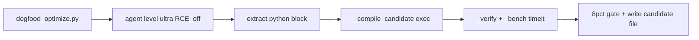
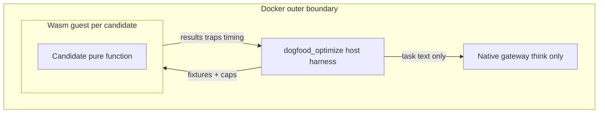

# WASM-in-Docker × dogfood (design note)

Design only. **No wasm runtime ships in the UniGrok gateway today.**

Hive pressure-test (partial agree): sandbox agents that **run** code, not ones
that **think**. Docker remains the outer boundary; wasm would be per-execution
capability isolation around a dangerous inner loop — not a rewrite of the app.

## Verdict

| Decision | Meaning |
|---|---|
| **NOGO now** | Do not embed wasmtime/wasmer in the gateway image “for dogfood.” The agent hive disables `remote_code_execution` and only emits text. |
| **Acknowledge surface** | Today’s untrusted local exec is host [`scripts/dogfood_optimize.py`](../scripts/dogfood_optimize.py) `_compile_candidate` → `exec(compile(...))`, not `server.py`. |
| **GO later** | When dogfood (or a Docker harness) makes sandboxed guest eval the promotion oracle, **or** a true local `remote_code_execution` path is designed (offline, no metered cloud). |

## Today’s dogfood path

1. Courier function source → `agent` at `ultra` with `remote_code_execution` off.
2. Extract one drop-in function from the reply.
3. Host compiles/execs the candidate in the script process.
4. Host verifies cases, benches with `timeit`, applies the ≥8% floor, optionally
   writes `dogfood_candidate_*.py` for manual review.

Thinking hive = no wasm. Production `remote_code_execution` stays on the xAI
cloud plane until a local path exists.

## Future wasm slot (trigger conditions)

Build the guest only when **one** of these is true:

1. Dogfood (or a Docker-side harness) moves candidate eval into a sandboxed guest
   and treats that guest as the promotion oracle (host `exec` is no longer sole
   trust root), **or**
2. A local `remote_code_execution` path is designed for offline / no-metered use
   (confused-deputy containment).

Until then: a sandbox with nothing to sandbox in the shipping gateway is
premature.

## Guest ABI (frozen when built)

| Layer | Role |
|---|---|
| Stays Docker/host native | Gateway, hive/agent, MCP, SQLite, candidate file I/O, promotion decision, network |
| Wasm guest | Pure candidate **inner function** only: verify + bench under memory/CPU/trap caps |
| ABI | Fixed typed inputs → outputs + trap/status; no host FS/net/env; host supplies fixtures |
| Promotion | Same fixtures in-guest: behavior match + ≥8% vs baseline guest; no trap/OOM under caps |
| Never wasm | LLM, hive personas, courier bridge, whole gateway, Docker entrypoint, cloud RCE |

### Hard cost

Model emits Python. WASM needs either:

- (a) a constrained subset + compile-to-wasm pipeline, or
- (b) a wasm-hosted interpreter.

That cost is why embedding wasmtime-py alone is not a free win.

### Cheaper interim (optional, still outside gateway)

Before wasm: isolate host `exec` with a subprocess / seccomp-style jail in the
dogfood script only. Same slot (`_compile_candidate` / `_verify` / `_bench`);
same “not in `server.py`” rule.

## What not to do

- Wasm-ify the whole app, agent, or hive.
- Treat Docker alone as in-process guest isolation.
- Ship a gateway wasm dependency with no in-process untrusted exec path.
- Treat this document as design guidance, not evidence that a wasm runtime ships.

## Related

- Dogfood loop: [`scripts/dogfood_optimize.py`](../scripts/dogfood_optimize.py)
- Physics vs posteriors: [`docs/DEOVERFIT.md`](DEOVERFIT.md)
- Public boundary: repository `AGENTS.md`
