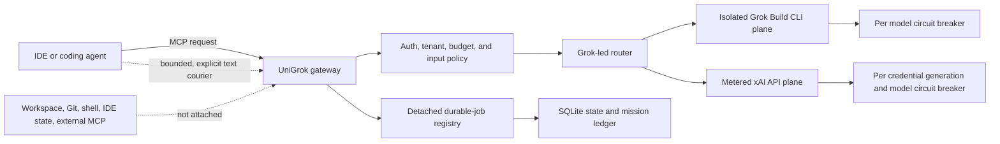
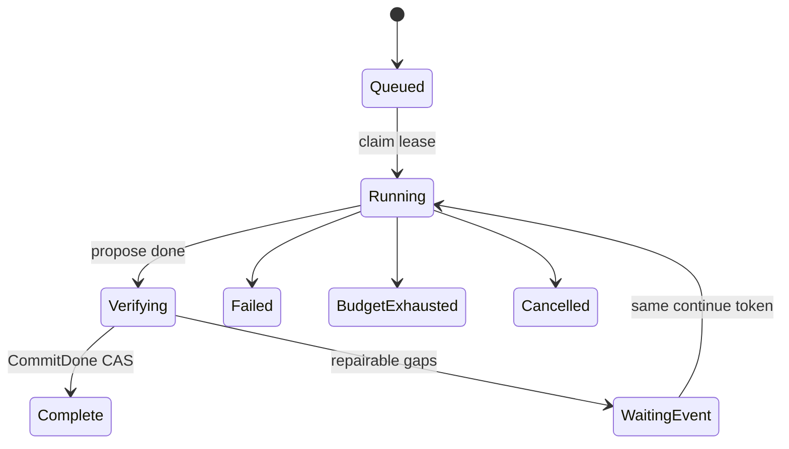

# UniGrok public architecture

Status: shipping public-core architecture. Design-only work is explicitly labelled in
its own documents. Runtime truth is reported by `grok_mcp_discover_self`, `/readyz`, and
`/runtimez`; a source checkout is not proof of what a container is running.

## System boundary

The gateway has no ambient authority over the caller's files, Git repository, shell,
credentials, other MCP servers, or IDE state. A caller may deliberately courier bounded,
redacted text, but that does not become workspace attachment.

## Execution planes

| Plane | Credential | Typical role | Isolation |
| --- | --- | --- | --- |
| Grok Build CLI | Grok subscription OAuth stored in the server volume | Local lead, routing, and subscription-first work | Disposable workspace/config home; local file, shell, edit, and MCP capabilities removed |
| xAI API | Server-owned or principal-bound API key | Metered specialists, files, media, search, remote code, or bounded recovery | Separate credential cache, concurrency pools, budgets, and circuit breakers |

Models are discovered independently from each live credential plane. Callers choose
intent and depth, not a hard-coded model allowlist. Cross-plane recovery is bounded and
receipted.

## Request and job lifecycle

Fast work can finish inside the initial sync window. Slow work detaches from the MCP
request. Generic durable tools return `pending` with a `job_id`; an autonomy-enabled
`agent` returns `continue` with `poll=true`, the same `job_id`, and its durable
`continue_token`. In either case the caller polls `agent_result` using the same ID.
Request timeout or caller cancellation does not cancel detached work.

```mermaid
stateDiagram-v2
    [*] --> Running
    Running --> PollView: sync window expires
    PollView --> Running: pending or continue; same worker continues
    Running --> Complete: result persisted
    Running --> Error: terminal error persisted
    Running --> Lost: service stops before provider outcome
    Complete --> [*]
    Error --> [*]
    Lost --> [*]
```

`lost` is terminal durable truth with an unknown provider outcome. It must not be
silently rewritten as caller cancellation, and it is unsafe to duplicate a metered or
mutating request until the provider state has been inspected.

Mission V2 adds a fenced mission ledger around agent quanta. Claims carry a lease token,
lease generation, checkpoint version, immutable acceptance hash, sealed artifacts, and
typed evidence. Only the current owner may advance mission truth.

Reattach is serial and uses the same `continue_token`. Terminal reattach reads canonical
durable truth and never reruns the model. Mission truth is authoritative over the legacy
job projection after restart.

## State and deployment topology

| Property | Local Compose | Hosted Cloud Run |
| --- | --- | --- |
| Source | Copied into the image at build time; no source bind mount | Same reviewed image, deployed by immutable digest |
| SQLite | Named persistent Docker volume | Instance-local `/tmp` in the current deployment |
| Restart continuity | Sessions, facts, terminal jobs, and mission ledger survive container recreation when volumes are retained | Instance replacement may lose sessions, facts, and jobs |
| Rollout | One fixed local service and state volume | Atomic revision cutover; no fractional canary while state is instance-local |

Every built source tree has a non-secret `source_fingerprint` reported by `/healthz`,
discovery, and `/runtimez`. Use `scripts/check_runtime_parity.py` to compare all public
runtime files in a checkout with a running local container. A version string, healthy
process, Git branch, image tag, or public revision alone is not source-parity proof.

## Safety ordering

Local validation and budget policy run before provider admission. Provider failures
advance the matching circuit breaker; local policy refusals do not. After cooldown,
exactly one half-open probe is admitted. Probe cancellation is fenced through the
longest provider deadline so an abandoned worker cannot overlap a replacement.

The release and incident evidence gates are in [Team readiness](team-readiness.md).
Detailed tool/status contracts are in the [Technical reference](reference.md), and the
hosted boundary is in the [remote deployment runbook](remote-mcp-deployment.md).
