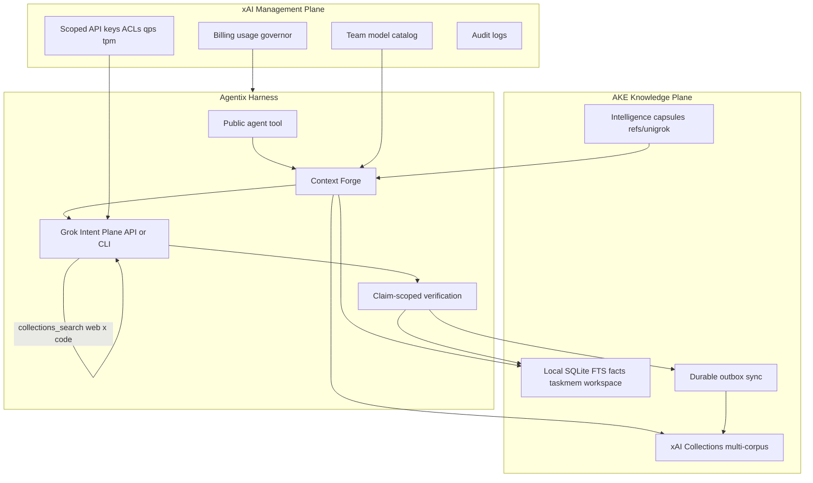

# Agentix Knowledge Engine (AKE) domination plan

- **Status:** Accepted target design; implementation PR stack follows this document
- **Date:** 2026-07-14
- **Decision owner:** Project maintainer, with Codex as integration authority
- **Scope:** xAI business / Management API / Collections surfaces as the
  intelligence fabric for UniGrok MCP, the Agentix harness, and AKE
- **Companion designs:** [authority-inversion.md](authority-inversion.md),
  [intelligence-capsule-v1.md](../okf/intelligence-capsule-v1.md),
  [swarm-v2-implementation-plan.md](../swarm-v2-implementation-plan.md)

This document is primarily **target-state**. It defines what UniGrok should
become when every xAI business feature is utilized at full strength.
Operational truth remains the current implementation until each remaining PR
below lands and is verified.

### Landed foundation (do not re-implement)

[PR #85](https://github.com/djtelicloud/grok-mcp-server/pull/85) landed the
**Grok-owned xAI worker harvest outbox** on `main` (schema v17,
`src/provider_harvest.py`, default collection `unigrok-worker-episodes-v2`).

That module is the first production Collections outbox brick:

- one-way upload of redacted subordinate-worker episodes
- Management API key required; no routing / retrieval / final-answer authority
- deliberately **inert** until a future Grok-owned broker calls
  `ProviderAttemptHarvester.run_once`
- cannot alias task-memory or knowledge collection names

AKE implementation PRs must **extend** this pattern (shared lease/CAS/outbox
discipline, secret redaction, name isolation), not invent a second harvest
path. Worker episodes are a dedicated corpus; they are never fused into
verified task-memory routing evidence.

## 1. Thesis

> **AKE is the always-on knowledge operating system for Agentix.**  
> Local SQLite is the private hot store. xAI Collections is the semantic
> long-range memory and hybrid retrieval fabric. The xAI Management API is the
> economic and security control plane. Grok remains the intent authority; code
> and Needle remain floor and reflex.

Ultimate domination means every xAI surface is a deliberate subsystem:

| xAI surface | Auth | Role in Agentix / AKE |
|---|---|---|
| Inference API | `XAI_API_KEY` | Intent plane, tools, research, vision, media |
| Management API | `XAI_MANAGEMENT_API_KEY` | Keys, ACLs, rate limits, team models, billing, audit |
| Collections API | Management key | Multi-corpus semantic memory + hybrid search |
| `collections_search` / `file_search` | Inference + collection IDs | Mid-reasoning retrieval (Tier-1 cloud tool) |
| Native tools | Inference | `web_search`, `x_search`, `code_execution` fused with AKE |
| Deferred completion (`chat.defer`) | Inference | Deep distill / research writeback into AKE |
| CLI plane | Grok OAuth | Near-$0 bulk generation, swarm, calibration harvest |

Team-scoped Management operations require `UNIGROK_XAI_TEAM_ID` (console team
UUID). Ordinary local telemetry never depends on it.



## 2. Relationship to authority inversion

[Authority inversion](authority-inversion.md) sets **who decides**. AKE sets
**what evidence Grok sees and can fetch**.

| Authority tier | AKE contribution |
|---|---|
| Grok intent plane | Live `collections_search` over scoped corpora; forged priors from local + remote hybrid retrieval |
| Needle reflex | Structured cards and projections optionally indexed into `ake-code-cards-v1` |
| Code floor | Versioned capability cards remain executable; AKE never replaces receipts |

Authority order is not computation order. Context Forge may prefetch AKE
candidates before Grok responds; Grok still owns the decision when available.

## 3. Multi-corpus Collections topology

AKE owns a **versioned corpus family**, not a single knowledge bucket. Each
corpus uses typed `field_definitions`, content-appropriate chunking, and
hybrid search.

| Corpus name | Content | Chunk style | Field definitions (`inject_into_chunk`) | Primary consumer |
|---|---|---|---|---|
| `ake-facts-v1` | Distilled durable facts | short tokens (~256–512) | `scope`, `confidence`, `source`, `verified`, `tenant` | Context Forge top-k |
| `ake-task-memory-v2` | Verified routing episodes only | identity header + prose | `model`, `route`, `success`, `category`, `plane` | RoutingAdvisor semantic rung |
| `ake-workspace-docs-v1` | ADRs, design docs, architecture | markdown tokens | `path`, `commit`, `kind`, `repo` | Research + coding modes |
| `ake-code-cards-v1` | Function / capability cards | code tokens | `symbol`, `module`, `effects` | Authority-inversion Forge |
| `ake-failures-v1` | Sanitized failure patterns | short | `error_class`, `plane`, `breaker` | Recovery routing |
| `ake-policies-v1` | Active gates, budgets, promotion policy | markdown | `policy_id`, `version` | Guardrails context |
| `ake-corpus-user-v1` | User PDFs / Excel / code drops | hybrid by MIME | `project`, `ingest_id` | User RAG |
| `ake-capsules-v1` | Capsule abstracts + digests | structured short | `capsule_id`, `kind`, `sha256` | Insider Factory bridge |
| `unigrok-worker-episodes-v2` | Redacted subordinate-worker episodes | frozen canonical JSON docs | `episode_id`, `document_digest` | Grok-owned harvest only (**landed**, no routing authority) |

### 3.1 Hard contracts

1. **Local SQLite is source of truth** for private consumer data. Collections
   are a semantic accelerator and cross-session fabric.
2. Only **verified** or **policy-approved** content enters routing-critical
   corpora (`ake-task-memory-v2`, learning paths on `ake-failures-v1`).
3. **Secret redaction** runs before any upload (reuse existing redaction
   surfaces including management-key scrubbing).
4. Corpora are **find-or-create by name + version**. Never mutate the schema of
   a live corpus name — bump the version suffix.
5. Field definitions set **`inject_into_chunk=true`** for contextual retrieval
   (native Collections capability).
6. Search readiness requires **`DOCUMENT_STATUS_PROCESSED`** (or SDK equivalent)
   — do not claim cloud readiness on upload alone.
7. **Fail open** to local FTS when Management / Collections is unavailable.

### 3.2 Legacy flag compatibility

Until a later major release:

| Legacy flag | AKE mapping |
|---|---|
| `UNIGROK_COLLECTIONS` | Enables `ake-facts-v1` mirror corpus |
| `UNIGROK_TASK_RAG` | Policy for `ake-task-memory-v2` (off / mirror / shadow / active) |
| `XAI_MANAGEMENT_API_KEY` | Required for any cloud corpus traffic |
| `UNIGROK_XAI_TEAM_ID` | Team-scoped billing, catalog, audit, key provision |

New flag surface (target):

```text
UNIGROK_AKE=off|mirror|shadow|active
UNIGROK_AKE_CORPORA=facts,taskmem,docs,...
UNIGROK_AKE_SOFT_BUDGET_USD=
UNIGROK_AKE_HARD_BUDGET_USD=
```

- **off** — zero Management Collections traffic; local-only intelligence
- **mirror** — durable outbox sync + readiness; no routing change; no live tool
- **shadow** — live search + fusion + recorded verdicts; routing unchanged
- **active** — Forge + live `collections_search` + task-RAG active policies

## 4. Live `collections_search` as Tier-1 tool

Maximum intelligence is not stuffing every document into the system prompt.
Attach the native xAI tool so **Grok decides when to retrieve mid-reasoning**:

```python
# Target shape on the API plane when AKE is active
tools = [
    collections_search(
        collection_ids=resolved_active_corpus_ids,
        retrieval_mode="hybrid",  # keyword + semantic
    ),
    # existing: web_search, x_search, code_execution
]
```

| Mode | Prefetch | Live tool |
|---|---|---|
| `fast` | Local + optional tiny top-k | Off (unless user pins research) |
| `auto` / `reasoning` | Local + bounded multi-corpus | On when AKE ≥ shadow and API plane |
| `thinking` / `research` | Local + multi-corpus | On; broader corpus allowlist |
| coding-shaped prompts | facts + docs + code-cards | On for those corpus IDs |

CLI-plane turns never invent cloud hits: use local FTS plus last-known-ready
AKE snapshot cache only.

## 5. Context Forge packet

Every public `agent` turn should assemble:

1. **Local FTS** — facts, task memory, workspace evidence (private, sub-ms)
2. **AKE hybrid prefetch** — one bounded multi-corpus search when ready
   (token bucket, short timeout, fail-open)
3. **Needle projections** when specialists are registered
4. **Code-floor capability cards**
5. **Live tools** for deeper retrieval and external grounding

Fusion (extends task-RAG math):

```text
score = w_local * norm_bm25
      + w_remote * norm_semantic * 2^(-age_hours / half_life)
      + w_verified * verified_bonus
      + w_path * path_overlap
```

Raw remote chunks are **candidates with provenance**, never authority, until
claim-scoped verification succeeds.

## 6. Management plane as closed-loop governor

The Management API is not a dashboard side quest. It is economic and security
intelligence for the harness.

| Capability | Target UniGrok behavior |
|---|---|
| Team model catalog | Ground-truth routing candidates; cache and refresh; never invent model IDs |
| Scoped child keys + ACLs | Separate `unigrok-agent`, `unigrok-judge` (chat, low tpm), `unigrok-swarm`, `unigrok-image` keys |
| `qps` / `qpm` / `tpm` | Swarm cannot starve the agent; judges cannot blow daily budget |
| Billing usage analytics | Soft/hard USD caps demote modes or refuse non-critical paid work |
| Billing info | Control Center + agent notices for prepaid/credit posture |
| Key propagation | Fail closed on brand-new keys until clusters report ready |
| Audit logs | Enterprise timeline; optional sanitized anomalies into `ake-failures-v1` |

### 6.1 Credential topology (target)

```text
XAI_MANAGEMENT_API_KEY   # never used for inference; never in IDE configs
XAI_API_KEY              # primary agent (or derived unigrok-agent key)
UNIGROK_XAI_TEAM_ID      # team ops when business features enabled
UNIGROK_XAI_JUDGE_KEY    # optional; else provisioned child key
UNIGROK_XAI_SWARM_KEY    # optional; else provisioned child key
```

Inference keys remain stripped from CLI subprocesses. The management key never
reaches CLI children or caller projects.

Child-key provisioners are **admin-gated and default off**.

## 7. Closed learning loops

Intelligence compounds only when write paths are verified and read paths are
gated.

| Loop | Write path | Read path | Rollout |
|---|---|---|---|
| Task-RAG | verified `task_memory` → outbox → `ake-task-memory-v2` | borderline routing | off → mirror → shadow → active |
| Fact distillation | `distill_session` / auto-distill → knowledge → `ake-facts-v1` | Forge + live search | local always; cloud when AKE on |
| Semantic evals | shadow judge scores on telemetry | Control Center; future calibration | off → shadow; no routing until authorized |
| Failure harvest | redacted breaker/errors → `ake-failures-v1` | recovery context | opt-in / contributor |
| Workspace docs | land-time ADRs/design → `ake-workspace-docs-v1` | research/coding | contributor mode |
| Capsule index | promoted capsules → `ake-capsules-v1` | Insider Factory | Git DAG authority |
| Preference pairs | agentic DPO payloads | offline training only | Stage-gated; separate authorization |

Public consumer SQLite rows never bulk-upload. Only redacted, bounded,
policy-allowed projections leave the machine. Insider capsules remain on
`refs/unigrok/*`; Collections holds indexes and abstracts, not private SQLite
bytes.

## 8. Agentix harness product surface

1. **Single public `agent` tool** remains the entry point; AKE is infrastructure
   plus optional status metadata.
2. **Mode-aware corpus scopes** for auto / fast / reasoning / thinking / research.
3. **Plane-aware AKE** — cloud Collections only on API plane; CLI stays excellent offline.
4. **Research writeback** — deferred research → distill job → AKE facts.
5. **Swarm** — CLI generation; budget-capped API child keys for judges; champions
   summarized into `ake-code-cards-v1`.
6. **Control Center** — corpus health, process %, sync lag, management-key
   validity (boolean), team burn vs soft/hard cap, child-key matrix (IDs only).
7. **Ops CLI** — `unigrok-mcp ake status|sync|backfill|provision-keys|catalog-refresh`.

### 8.1 Tenancy

- Multi-tenant Cloud Run: corpus names namespaced by authenticated principal
  hash; never shared across principals.
- Contributor Forge and stable public MCP keep the existing workspace boundary.

## 9. Implementation PR DAG

| PR | Branch sketch | Scope | Depends |
|---|---|---|---|
| **Landed** | `codex/xai-worker-harvest-outbox` → **PR #85** | Worker episode harvest outbox (`provider_harvest`, v17) | — |
| **PR0 Design** | `grok/ake-domination-design` | This document + cross-links + env comments | Landed #85 |
| **PR1 Corpus registry** | `grok/ake-corpus-registry` | Typed registry, field defs, chunk presets, find-or-create, readiness | PR0 |
| **PR2 Unified outbox** | `grok/ake-outbox` | Generalize lease/CAS outbox patterns for facts / taskmem / docs; **reuse** harvest discipline from #85 | PR1 + #85 |
| **PR3 Live collections_search** | `grok/ake-live-tool` | Attach tool on API agent; mode scopes; fail-open | PR1 |
| **PR4 Forge fusion** | `grok/ake-forge` | Multi-corpus prefetch + fusion into dynamic context (never worker episodes into routing) | PR2, PR3 |
| **PR5 Management governor** | `grok/ake-mgmt-governor` | Team catalog, soft/hard caps, optional child-key provisioner | PR0 |
| **PR6 Ops surface** | `grok/ake-ops-surface` | `/metrics` AKE panel, CLI, Control Center health | PR2, PR5 |
| **PR7 Active promotion** | `grok/ake-active` | Evidence-gated promotion to `UNIGROK_AKE=active` for opt-in installs | PR4 + evals |
| **PR8 Harvest broker** | `grok/ake-harvest-broker` | Explicit Grok-owned drain of `ProviderAttemptHarvester` (still no routing authority) | #85 + policy |

Each implementation PR: agent-prefixed worktree, full tests, draft PR, Codex
exact-head review, `./scripts/land`.

## 10. Risks and non-goals

**Risks**

- Collections storage and index cost grow with corpus count — allowlists and
  retention land with PR1.
- Management keys are high privilege — provisioner default off, admin-gated.
- Live search couples the agent to the API plane — CLI-first installs must stay
  excellent without Management credentials.
- Unverified remote text must never become routing authority or training truth.

**Non-goals for this design**

- Replacing local SQLite with cloud-only memory
- Merging SuperGrok subscription usage into API billing statistics
- Silent live Stage-2 dataset generation or training (separate authorization)
- Putting management or inference keys into IDE MCP configs

## 11. Success definition

UniGrok dominates when:

1. Every xAI business surface maps to a named AKE / Agentix subsystem.
2. Verified learning compounds turn-over-turn without elevating unverified text.
3. Grok retains intent authority with richer evidence and mid-turn retrieval.
4. Economic and ACL governors prevent runaway spend and privilege sprawl.
5. Codex can land the PR stack safely behind `off → mirror → shadow → active`.

## 12. References (external xAI surfaces)

- [Using Management API](https://docs.x.ai/developers/management-api-guide)
- [Management API reference](https://docs.x.ai/developers/rest-api-reference/management)
- [Collections](https://docs.x.ai/developers/files/collections)
- [Collections search tool](https://docs.x.ai/developers/tools/collections-search)
- [Collections REST reference](https://docs.x.ai/developers/rest-api-reference/collections/collection)
