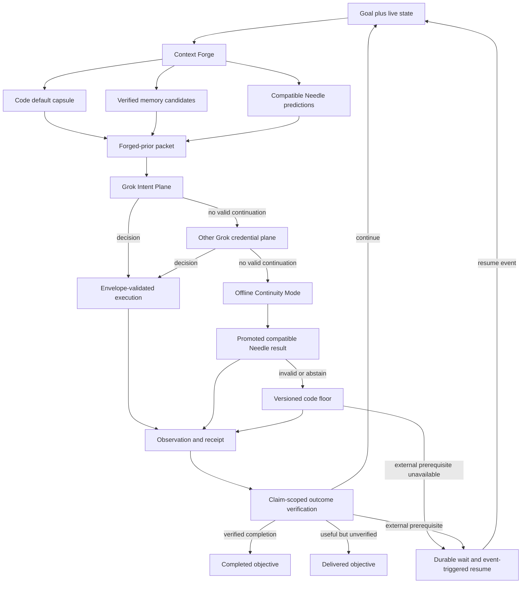

# UniGrok authority inversion: LLM-first, Needle-reflex, code-floor

- **Status:** Accepted target design; implementation has not started
- **Date:** 2026-07-13
- **Decision owner:** Project maintainer, with Codex as integration authority
- **Scope:** Runtime authority, continuity, memory, learning, verification, and distribution

This document defines the target runtime behind UniGrok's single public
`agent` experience. It is intentionally a design specification rather than a
claim about current behavior. The current implementation remains the source of
operational truth until each rollout gate below lands and is verified.

## 1. Thesis and product identity

> **UniGrok gives every IDE a Grok-led autonomous engineering team as one
> unified `@Grok` experience. Code supplies advice, boundaries, evidence, and
> recovery—not predetermined intelligence.**

The authority hierarchy is:

1. **LLM first:** Grok interprets the objective, chooses among compatible
   capabilities, orchestrates tools and collaborators, and decides what to do.
2. **Custom Needle second:** narrow, task-family-specific Needle specialists
   provide fast structured reflexes and, when the Grok tier cannot produce a
   valid continuation, may execute only a promoted result compatible with the
   active gateway contract.
3. **Hard code third:** versioned defaults are always prepared as context and
   remain the executable continuity floor if Grok and the eligible Needle
   specialist are unavailable or abstain.

Authority order is not computation order. Code can prepare a default, memory
can retrieve evidence, and Needle specialists can predict in parallel before
Grok responds. Grok still receives first decision authority while available.



"All code is context" does not mean dumping source text into every prompt. A
function is represented by a typed card: purpose, inputs, preconditions,
effects, failure modes, receipts, examples, and executable reference. The same
implementation can therefore be both useful context for Grok and the
last-known-working operation behind a code-floor capsule.

The code floor is predetermined recovery, not predetermined intelligence. It
has no semantic authority while a higher tier supplies a valid continuation,
and it never masquerades as Grok reasoning when it runs.

"The LLM has no limits" means UniGrok does not impose arbitrary semantic route
tables, reflection counts, or complexity ceilings that substitute code for
Grok's judgment. Provider availability, context windows, user-granted
authority, and user-selected spend are external facts. They become
observations and continuation conditions rather than false successful answers.

### 1.1 Current state versus target state

| Concern | Current implementation | Target |
|---|---|---|
| Model and route choice | Deterministic feature thresholds and ordered candidates choose before Grok runs (`src/routing.py:1-27`, `src/utils.py:7767-7947`) | Code emits an advisory proposal; Grok decides among live compatible choices |
| Agent completion | A response with no tool call becomes `final_answer` (`src/utils.py:5821-5826`) | Completion requires a `VerifiedOutcome`; syntactic stopping is not semantic completion |
| Needle | One bounded tools-array context projection with no runtime caller (`src/intelligence_payloads.py:979-1135`) | Typed specialist registry, shadow inference, training, evaluation, promotion, and rollback |
| Learning evidence | `task_memory.success` is now tri-state; provider stops remain `NULL`, legacy positives are quarantined by schema v14, and routing/RAG consume verified rows only | Content-addressed TenantVerifiedEpisodes are learning truth; SQL is a rebuildable projection |
| Semantic grading | Optional shadow grader defaults off (`src/semantic_evals.py:44-69`) | Verification sources are first-class and gate every reader and training export |
| Continuity | Route exceptions eventually return fallback/error results | Attempts become observations; objectives persist, degrade, or wait and resume |

The accurate starting assessment is: **protocol pieces exist, labels are not
clean, and the authority-inverted hot path is not integrated.**

### 1.2 Agentix Knowledge Engine (AKE) Context Forge

Authority inversion defines **who decides**. The companion
[AKE domination plan](ake-agentix-domination-plan.md) defines **what verified
evidence Grok receives and can fetch**:

- Local SQLite remains the private hot store.
- xAI Collections become a multi-corpus semantic fabric (facts, verified task
  memory, docs, code cards, failures, policies, user corpus, capsule indexes).
- Native `collections_search` attaches as a Tier-1 cloud tool so Grok can
  retrieve mid-reasoning under mode-scoped corpus allowlists.
- The Management API becomes the economic and ACL governor (team catalog,
  scoped child keys, soft/hard spend caps, audit), never an inference credential.

Context Forge assembles local FTS, optional AKE hybrid prefetch, Needle
projections, and code-floor cards into advisory priors. Raw remote chunks stay
candidates with provenance until claim-scoped verification. AKE rollout is
`off → mirror → shadow → active` and must not elevate unverified text to
routing or training authority.

## 2. Three planes of responsibility

The same runtime design serves different audiences without allowing
contributor mechanics to leak into public projects.

| Plane | Owner | Contents |
|---|---|---|
| UniGrok product factory | Project admins and contributors | This repository, CI/CD, releases, contributor worktrees, landing receipts, global evaluation artifacts |
| Customer intent plane | Customer policy owner and their Grok | Customer objective, key/credential choice, connected projects, granted authority, tenant-local memory and models |
| Customer capability plane | Grok-discovered agents and tools | GitHub MCP, Docker Agent, IDE tools, Gordon handoffs, and future customer-supplied MCP capabilities |

Contributor-only `AGENTS.md`, skills, worktrees, landing commands, and project
evidence never become public-user runtime requirements. Public customers see
one Grok identity even when the underlying team changes dynamically.

Tenant BYO credentials, private episode records, tools, standing policies, and
specialists remain tenant-scoped; no customer episode enters a global model or
another tenant without an explicit data policy. IDE agents, GitHub MCP, Docker
Agent, and Gordon are discoverable capabilities behind `@Grok`, not separate
public identities. Docker is an optional runtime/capability adapter, not a
public installation prerequisite.

### 2.1 Runtime distribution: persistent core, opportunistic edge

Execution placement does not change the authority ladder. The target product
uses one persistent core plus replaceable edge and capability adapters:

| Layer | Target role | Non-negotiable boundary |
|---|---|---|
| `@Grok` LLM tier | First semantic authority over every compatible live capability | UI framework, process host, and accelerator choice never grant or remove model authority |
| Supervised native `uv` Python | Default public durable core: `/mcp`, credentials, Grok API/CLI adapters, objective and episode ledgers, envelope validation, Git/subprocess work, recovery, and the code floor | Closing a browser or lacking Docker cannot stop the base service, discard an objective, or erase its recovery state |
| HTMX | Control Center forms, HTML fragments, status updates, and SSE-driven progress | Presentation only; `/mcp` remains the canonical structured agent interface and UI fragment routes do not become a second semantic API |
| WebMCP plus a small JavaScript bridge | Expose the live page and typed function-card descriptors to browser agents | Tab-bound and ephemeral; it owns no credentials, objective truth, durable memory, or headless continuity |
| Optional UniGrok `app.wasm` | Sandboxed browser execution for compatible Needle shadow/reflex inference and bounded pre/post-processing | It is a UniGrok runtime artifact, not part of the WebMCP protocol, and every result re-enters the same envelope, receipt, and verification path |
| Optional Mojo/MAX adapter | Accelerate measured native Python hotspots behind unchanged contracts | Python remains the tested fallback; Apple targets use the documented Metal path, and raw Vulkan is not a public product dependency |
| Optional Docker and Docker Agent adapters | Container operations, stronger isolation, reproducible CI/hosted deployment, and capabilities that genuinely require a container host | Their absence disables only those capabilities; they never disable ordinary UniGrok or become a public installation prerequisite |
| Optional Gordon handoff | Interactive Docker expertise when a supported Gordon surface is present | Gordon is an external collaborator, not an autonomous recovery dependency; no effectful machine path exists until Docker documents a structured interface and UniGrok proves standing-permission and receipt contracts |

The browser and durable service are deliberately complementary. WebMCP is a
[Community Group draft](https://webmachinelearning.github.io/webmcp/) whose
tools exist only while the page is open; current Chrome guidance describes MCP
as the persistent service and WebMCP as its live browser partner
([comparison](https://developer.chrome.com/docs/ai/webmcp/compare-mcp)).
UniGrok may ship an `app.wasm`, but WebMCP does not define or require that
artifact.

HTMX lets the Python service return HTML fragments instead of maintaining a
second client-side application state machine
([documentation](https://htmx.org/docs/)). A small generic bridge reads typed
tool descriptors rendered with those fragments and registers or unregisters
them after HTMX swaps. The bridge carries context; it does not hard-code which
engineering choice Grok must make. Long-running progress can use HTMX's
[SSE extension](https://htmx.org/extensions/sse/) while receipts and machine
clients continue to use the canonical structured contracts.

Browser Needle execution is an optimization and provider-offline reflex surface
only while the durable Python core remains alive; it is never the only copy of
a required specialist. If the core is down, browser inference is advisory or
shadow-only and cannot execute actions, promote a model, create a durable
receipt, or assert a verified outcome. Where a safe portable export is
supported, native Python and browser WASM executors consume the same
content-addressed model and gateway contract. Browser inference may use WASM
or WebGPU through a measured executor such as
[ONNX Runtime Web](https://onnxruntime.ai/docs/tutorials/web/); an unavailable
or incompatible browser executor abstains and leaves the native Needle or code
floor path intact.

Mojo is evaluated only after profiling demonstrates a useful native hotspot.
It may be installed inside the same `uv`-managed environment and called behind
the Python contract; it is not assumed to produce `app.wasm`. On Apple silicon,
the native acceleration path follows Mojo's documented Metal support, while a
browser implementation uses WebGPU rather than requiring raw Vulkan
([Mojo GPU model](https://docs.modular.com/mojo/manual/gpu/fundamentals/)).

This is an additive migration. The current Docker path remains supported until
a native supervised install proves equivalent install, upgrade, boot,
crash-recovery, rollback, credential-isolation, durable-state, API-plane, and
available CLI-plane behavior. Runtime-aware onboarding, authentication,
restart/status controls, Control Center copy, and public documentation must
land before the default changes; today's Docker-facing surfaces remain current
truth until then. Only after those gates pass does native `uv` become the
public default. Docker remains available afterward for container-specific
work, hosted deployments, reproducible CI, and users who prefer that isolation
boundary. Gordon remains an optional external handoff until a supported
machine interface and standing-permission contract are proven.

## 3. Authority and continuity ladder

### 3.1 Normal operation

For every decision gateway, UniGrok prepares lower-layer candidates in
parallel. Every currently reachable Grok credential plane belongs to the same
LLM authority tier. Live capability, the current deterministic route proposal,
the code-floor capsule, memory, and Needle results are labeled priors. Grok can
accept, override, combine, ignore, or request more context, and records its
reason in the decision receipt. The invariant envelope validates the selected
action; it does not decide the engineering preference.

A minimal availability broker must physically establish the first usable Grok
transport. That bootstrap is not semantic routing authority: it observes
reachability and the caller's credential policy, then presents the full valid
choice set to Grok.

### 3.2 Grok credential-plane recovery

An API failure, throttling event, or unavailable API key does not immediately
delegate authority to Needle. It becomes an observation and may trigger
another LLM-plane attempt when that plane is compatible with the caller's
credential and billing policy. The CLI plane remains Grok, not a fallback
algorithm. Authority descends only when no Grok plane produces a valid
continuation.

The credential-plane policy is an externally granted boundary. A
`same_plane` request never crosses that boundary. A `cross_plane` request may
use the compatible recovery ladder and records the transition.

Grok abstention, a clarification request, an envelope-rejected proposal, or a
no-tool planning stub is an observation, not silent permission to fall
through. UniGrok first returns that observation to the Grok tier, tries another
permitted Grok plane when useful, or records the needed clarification. An
execution lease can end with `unavailable` or
`lease_exhausted_without_valid_continuation`; either result may temporarily
descend the affected gateway to Needle and then code, but the objective stays
active and Grok reclaims first authority on its next eligible resume.

### 3.3 Offline Continuity Mode

If the Grok tier records `unavailable` or
`lease_exhausted_without_valid_continuation`, the service remains available in
**Offline Continuity Mode**:

- A promoted Needle specialist may choose and bind only tools explicitly
  eligible under the active gateway contract.
- Execution requires tenant standing authorization plus an exact typed effect
  contract. Eligible effects are preauthorized, bounded, and mechanically
  verifiable, with reversal or compensation where the action is not
  idempotent.
- Irreversible or authority-expanding actions durably wait for the missing
  authorization or a Grok continuation; Needle cannot grant itself authority.
- Other objectives enter the durable continuation ledger with the exact
  missing prerequisite and resume trigger.
- Every offline action accrues **supervision debt**: its inputs, prediction,
  execution, observation, and effect evidence are retained for Grok to audit
  after reconnection.
- Offline actions never self-label as verified merely because they returned.

The single `@Grok` identity is an interaction surface, not false provenance.
Every terminal response and receipt exposes the actual `decider`, plane,
verdict, continuity mode, supervision-debt state, and next resume condition.
Offline Needle or code output is visibly labeled as continuity output and never
presented as an ordinary Grok-verified success.

The initial offline rollout exposes read-only resources and deterministic
status/inspection functions as the first proven effect family, not as the
permanent autonomy boundary. Mutation families are admitted only after their
standing-authorization, effect-verifier, and compensation contracts are
independently proven.

### 3.4 Needle-ReAct micro-loop

Needle performs one-pass function-call generation and may emit zero, one, or
multiple calls. A validated result can drive a small continuity loop:

```text
projected state -> Needle call -> envelope -> idempotent tool -> digest observation
       ^                                                        |
       +--------------------------------------------------------+
```

This is not in-context learning. It is repeated inference over a digest of the
latest verified state. The micro-loop is eligible only for gateway contracts
whose progress and repetition can be measured. Same-call/no-progress
detection, per-step digests, a tenant-authorized execution lease, and the
durable wait transition prevent an offline busy loop. Expiring a lease
checkpoints the attempt and schedules its resume; it never terminates the
objective or turns partial work into a successful final answer.

### 3.5 Public standing policy and owner controls

Non-technical customers do not author gateway schemas or promotion rules.
UniGrok ships signed, versioned policy profiles with plain-language grants. The
default public profile keeps Grok first, preserves the selected credential
plane, allows offline inspection/status effects, and waits on unverified
mutations. A customer may grant a broader autonomous-project profile once;
that standing grant admits only registered effect contracts with verifiers and
reversal or compensation where required.

Lease bounds derive from the customer's standing spend/time/resource policy
and live provider facts, not hard-coded task complexity. Reaching a bound
checkpoints and resumes or waits; it never fabricates completion. Owners can
cancel an objective, grant or revoke standing authority, set spend, force a
wait, inspect debt and resume conditions, and trigger user-owned resume events
without an operator.

On Grok reconnection, supervision debt is audited automatically. Failed or
unavailable audit quarantines the affected offline family and alerts the owner;
it does not erase debt or block unrelated verified work.

## 4. VerifiedOutcome: truth before learning

The runtime now separates transport stopping from verified outcome evidence:

1. `final_answer` and successful `fallback` results persist `success=NULL`.
2. Explicit gateway-detectable failures persist `0`; the storage boundary
   rejects every value outside `NULL`, `0`, and `1`.
3. Schema v14 withdraws unsupported historical positive labels.
4. RoutingAdvisor, local semantic RAG, the versioned cloud mirror, metrics,
   and prompt rendering preserve or require the verified-only distinction.
5. Auxiliary `history-compaction` operations are excluded from task success
   denominators, and shadow semantic judges remain observational.

This closes the false-positive learning path, but it does not establish the
target learning authority. No training or promotion work starts until a
versioned verifier can write attributable `1` outcomes and the episode ledger
is integrated.

### 4.1 Preserve compatibility; add truthful fields

`finish_reason` remains unchanged because existing clients and offline cassettes
consume it. The design adds parallel semantics:

| Field | Values / meaning |
|---|---|
| `episode_id` | Stable content-addressed episode identifier |
| `objective_id` | Durable user objective that survives attempts, restarts, and waits |
| `attempt_id` | One execution lease within the objective |
| `gateway_family` | Typed gateway contract that produced the decision |
| `decider` | `grok_api`, `grok_cli`, `needle:<checkpoint>`, or `code:<capsule>` |
| `continuity_mode` | `online`, `offline_reflex`, `code_floor`, or `waiting` |
| `supervision_debt` | Outstanding offline episode IDs requiring Grok audit |
| `decision_sha256` | Canonical decision digest |
| `contract_hash` | Input/output/envelope contract identity |
| `tool_catalog_hash` | Compatible tool-name, parameter-key, and schema identity |
| `finish_reason` | Existing transport/runtime field, unchanged |
| `terminal_type` | `final_answer`, `abstention`, `clarification_request`, `refusal`, or `partial` |
| `attempt_outcome` | `tool_success`, `tool_failure`, `timeout`, `denied`, `partial`, or `abstained` |
| `lease_end` | `continued`, `unavailable`, `lease_exhausted_without_valid_continuation`, `waiting_external`, `delivered`, `completed`, or `cancelled_by_owner` |
| `objective_state` | `active`, `waiting_external`, `delivered`, `completed`, or `cancelled_by_owner` |
| `next_resume_condition` | Event, evidence, capability, or backoff condition that reactivates work |
| `verdict` | `verified_success`, `verified_failure`, or `unverified` |
| `verification_source` | Claim-scoped source named by the matrix below |
| `verification_confidence` | Measured evidence strength, never model self-confidence |
| `verification_ref` | Digest/receipt/test/eval reference |
| `valid_until` | Dynamic TTL result, including structural invalidators |

Transport completion and `terminal_type=final_answer` do not imply
`verified_success`. Attempt failure is an observation, not objective failure.
Only evidence satisfying the gateway's declared effect or output contract may
transition an objective to `completed`; only the owner may transition it to
`cancelled_by_owner`.

Pure Q&A and advice gateways declare output rather than effect contracts. A
useful answer without independent verification transitions to `delivered`, not
`completed` or perpetual `active`; user acceptance or later contract evidence
can close it without mislabeling the answer as verified.

The objective state machine is explicit:

| Event | Lease result | Objective transition | Resume |
|---|---|---|---|
| Valid gateway progress | `continued` | stays `active` | Next gateway immediately |
| Grok tier cannot be reached | `unavailable` | stays `active` while an eligible lower tier runs; otherwise `waiting_external` | Capability or credential event |
| Grok produces no valid continuation in its lease | `lease_exhausted_without_valid_continuation` | stays `active` while Needle/code continues; otherwise `waiting_external` | Next eligible tier, then Grok reclaims on a later lease |
| Clarification/authority is required | `waiting_external` | `waiting_external` | Owner response or grant event |
| Useful unverified answer is returned | `delivered` | `delivered` | User acceptance or follow-up |
| Completion contract is verified | `completed` | `completed` | None |
| Owner cancels | `cancelled_by_owner` | `cancelled_by_owner` | None |

Every effect dispatch uses a stable `effect_id` derived from `objective_id`, a
durable semantic effect slot, normalized tool/operation arguments, and target
scope. The effect slot is allocated once in the objective ledger and survives
replanning, retries, and new attempts; `attempt_id` is provenance only. A user
who intentionally repeats an identical effect receives a new semantic slot.
UniGrok persists dispatch intent before execution and reuses the same
`effect_id` until a verifier resolves it. On restart, an ambiguous dispatch is
reconciled by its effect verifier before it can be executed again.

### 4.2 Claim-scoped verification matrix

Verification is declared per gateway claim; there is no global evidence rank
that can verify an unrelated effect. The gateway spec names its
completion-critical claims and the verifier types accepted for each one. An
episode is `verified_success` only when every completion-critical claim passes;
conflicting evidence cannot be washed out by a higher-ranked receipt.

| Evidence | What it may verify by default |
|---|---|
| Landing receipt | Exact commit reachability and the tests named by that receipt; it does not prove deployment, product behavior, or answer correctness. The existing `workspace_evidence.task_memory_ids` back-link (`src/workspace_memory.py:345-394`) connects those exact claims to episodes. |
| Oracle-backed eval | Only the expected outputs/effects declared independently in that eval contract |
| Tool/effect receipt | The registered tool effects whose postcondition verifier passes |
| Structured reviewer | Advisory unless the gateway explicitly accepts its schema, independence, provenance, and calibrated slice; unavailable is always `unverified` |
| Semantic evaluation | Advisory by default; it can verify only a gateway that explicitly defines and calibrates that semantic contract |
| Owner acceptance | Acceptance or closure of a delivered objective, not the factual truth of its claims |
| No compatible verifier | `unverified` |

`_save_task_memory_safe` becomes the single writer choke point for episode
labels. All task-memory rendering, routing evidence, calibration export,
Needle training export, and golden-task export require a compatible verdict.
The cassette export path at `evals/cassettes.py:73-150` must not let a stored
answer and transport-only `final_answer` become a self-confirming golden task
without an independent confirmation gate.

### 4.3 Effect claims require effect evidence

The verifier extracts claims such as "tests pass", "file updated", "PR
created", or "deployed" and looks for matching effect receipts. A response may
still be useful prose when evidence is absent, but the relevant claim and
episode are downgraded to `unverified` with a visible caveat. This applies
uniformly to Grok, Needle, and code-floor results.

## 5. Tenant VerifiedEpisodes are the learning database

SQL is not semantic memory or learning authority. The target source of truth
is a tenant-private, append-only ledger of content-addressed
**TenantVerifiedEpisode** (`uep1`) records. This is a new public-runtime
protocol; it is not the repository's existing Insider IntelligenceCapsule
(`ucap1`) protocol and must never share its refs or trust roots.

| Artifact | Scope | Purpose |
|---|---|---|
| `ucap1` Insider IntelligenceCapsule v1 | Factory contributors/admins only | Git-backed shared project intelligence defined by [the existing protocol](../okf/intelligence-capsule-v1.md) |
| `uep1` TenantVerifiedEpisode v1 | One tenant/project policy scope | Private objective, attempt, evidence, learning, lineage, and continuation truth |
| Default capsule | Versioned product/runtime code | Advisory prior and executable continuity floor; not an episode database |

The `ucap1` separation contract remains unchanged: public SQLite bytes, rows,
and `uep1` records never enter an IntelligenceCapsule, Git ref, hosted control
request, or factory checkpoint dataset. Tenant specialists learn only from
compatible records in their permitted tenant scope. Any future cross-scope
learning requires a separate consented export protocol that creates an
independently reviewed, redacted derivative; raw `uep1` bytes are not an export
format.

The P1 protocol specification and validators must define canonical bytes and
authentication before the first dual write. Its required identity shape is:

```text
B  = restricted_canonical_json(body)
D  = SHA-256(B)
ID = "uep1:sha256:" + lowercase_hex(D)
A  = "UniGrok TenantVerifiedEpisode v1\0" + tenant_scope + "\0" + D
```

The body contains the protocol/version and tenant scope. `episode_id` is
derived outside the body, so identity is not self-referential. `created_at` is
deliberately part of the immutable event identity; semantic duplicate
detection uses objective, attempt, decision, and effect digests instead of the
event ID. The byte profile reuses the restricted canonical-JSON rules already
implemented for `ucap1`, but the protocol names, validators, storage, and
authorization remain separate. Attestations cover `A`: a local installation
trust key for a local tenant, or a tenant-bound workload identity for hosted
execution. Neither is a correctness oracle.

Durable resume also requires causality, not only content integrity. Every
objective event carries `objective_sequence`, `previous_objective_event`, and
the active monotonic `writer_fence`. The tenant ledger exposes one atomic
operation—`append_event(expected_head, writer_fence, event) -> new_head`—and
rejects stale heads or fences before any effect dispatch. Local storage may
implement it with an installation-scoped lock plus atomic replacement; hosted
storage uses an equivalent transactional or conditional write. Authenticated
head checkpoints are ledger records, not SQLite-only state. Replay starts from
the authenticated objective head and verifies a contiguous hash-linked
sequence, so omitted, reordered, forked, or stale-worker events fail closed.

An illustrative envelope is:

```json
{
  "body": {
    "protocol": "org.grokmcp.tenant-verified-episode",
    "version": 1,
    "tenant_scope": "local-project:...",
    "objective_id": "...",
    "attempt_id": "...",
    "objective_sequence": 7,
    "previous_objective_event": "uep1:sha256:...",
    "writer_fence": 42,
    "gateway_family": "tool_selection",
    "contract_hash": "sha256:...",
    "tool_catalog_hash": "sha256:...",
    "input_digest": "sha256:...",
    "proposals": [],
    "decision": {},
    "decision_sha256": "sha256:...",
    "effect_intents": [{"effect_id": "sha256:..."}],
    "observations": [],
    "attempt_outcome": "tool_success",
    "lease_end": "continued",
    "objective_state": "active",
    "verdict": "verified_success",
    "verification": {"source": "tool_effect_receipt", "refs": []},
    "effect_receipts": [],
    "continuity_mode": "online",
    "supervision_debt": [],
    "next_resume_condition": {"kind": "next_gateway"},
    "provenance": {},
    "created_at": "..."
  },
  "digest": {"algorithm": "sha-256", "value": "..."},
  "attestations": []
}
```

The episode ledger provides:

- **Revocation:** append an authenticated tombstone, exclude the digest from
  the active corpus manifest, rebuild projections, and retrain checkpoints
  whose lineage contains it; physically delete payloads where policy or law
  requires it.
- **Audit:** every tenant checkpoint records the ordered episode-set hash that
  trained it.
- **Rebuild:** objectives, FTS indexes, few-shot sets, routing summaries, and
  specialist datasets can be reconstructed from tenant-private records.
- **Isolation:** tenant scopes have distinct storage roots, keys, manifests,
  checkpoints, and export policy.

### 5.1 SQL's transitional role

The current `GrokSessionStore` remains the operational implementation during
migration. Schema v14 has retired unsupported legacy positive labels and the
current readers use verified-only SQL projections. A later dual write creates
tenant-private episode records beside those transitional task-memory rows and
reuses the current durable outbox shape (`src/storage.py:111-126`).

The target agent runtime stores the append-only tenant ledger in its private
state root (or tenant-isolated hosted object store) and treats SQLite as an
optional, disposable materialized view for search, scheduler locks, and
concurrent coordination. SQL is never the learning or continuity record.
Canonical objective, attempt, episode, example, checkpoint-lineage, and
revocation events live in the TenantVerifiedEpisode/objective ledger; loss of
a SQL projection cannot erase an objective or its evidence. Early migration
phases may still depend on existing SQL jobs and sessions, but each phase must
reduce that dependency and prove replay before calling the affected state
rebuildable. A hosted account, billing, or GitHub-installation database is a
separate control-plane concern and is not Grok's memory.

Needle weights are lossy learned reflexes, not a replacement for original
episodes. Exact TenantVerifiedEpisodes remain necessary to relabel, revoke,
audit, split, evaluate, and reproduce fine-tuning.

## 6. One invariant envelope for every decider

All deciders pass through one pure, inspectable envelope interface with typed
lifecycle phases:

```python
validate_envelope(
    phase,  # proposal | action | transition | outcome | record
    subject,
    gateway_spec,
    live_capabilities,
    granted_authority,
    policy_facts,
    evidence,
) -> ValidatedProposal | ValidatedAction | ValidatedTransition | VerifiedOutcome | ValidatedRecord
```

It runs at five choke points:

1. before model/plane execution;
2. before every tool dispatch;
3. at every recovery-ladder transition;
4. after model/tool execution to verify the outcome and claimed effects;
5. before persistence, injection, or training export.

Phase-specific typed validators sit behind this one interface. Pre-dispatch
phases cannot claim postconditions; I11 is evaluated only for `outcome` and
`record`. The envelope validates facts and effects; it does not decide intent.

| ID | Invariant |
|---|---|
| I1 | Provider secrets remain in their declared credential plane and are never prompt/tool arguments. |
| I2 | Requested billing/credential fallback policy is preserved. |
| I3 | Selected model, agent, and tool exist in the live capability catalog. |
| I4 | Mutation requires an already granted runtime capability; model output cannot grant itself authority. |
| I5 | Workspace/path targets remain inside the attached project boundary. |
| I6 | Inputs, observations, default capsules, episode records, and receipts pass the pinned secret/redaction policy. |
| I7 | User-declared spend and external provider/resource limits are observed and receipted. |
| I8 | Gateway, checkpoint, default-capsule, episode, and tool catalogs have compatible schema hashes. |
| I9 | Tool names, argument keys, argument values, types, enums, ranges, and cross-field constraints validate. |
| I10 | Injected examples are verified, scope-compatible, non-revoked, secret-scanned, and dynamically live. |
| I11 | Claimed effects have matching effect evidence or are visibly marked unverified. |
| I12 | Tenant episodes, examples, and checkpoints never cross scopes without an explicit data policy and auditable lineage. |
| I13 | Terminal receipts truthfully expose the actual decider, verdict, continuity mode, debt, and resume condition. |

I9 is especially important for Needle. Its constrained decoder can restrict
tool names and parameter keys, but argument values remain generative. The same
validation also protects against hallucinated arguments from larger models.

Every envelope result is appended to the routing/decision receipt with the
contract version, rejected fields, and recovery action.

## 7. Typed decision gateways and the Needle reflex fleet

A **DecisionGatewaySpec** declares:

- input and output schemas;
- candidate and abstention vocabulary;
- compatible capability catalogs;
- default capsule builder and executable interpreter;
- Needle eligibility and specialist manifests;
- verification predicate and effect receipts;
- context projection and dynamic invalidators.

The target registry supports multiple task-family specialists. It does not use
one universal Needle and does not create one checkpoint per individual
function by default. Functions share a checkpoint when their input semantics,
output grammar, catalogs, and evaluator are compatible. A family splits only
when held-out slices demonstrate negative transfer and enough verified data
exists for both descendants.

| Gateway family | Grok responsibility | Needle eligibility | Code floor |
|---|---|---|---|
| `tool_selection` | Choose tools and arguments in the broader plan | **Eligible v1:** select known tools and bind schema arguments | Registered default call or abstain |
| `memory_selection` | Decide which evidence matters and request expansion | Shadow experiment: rank bounded episode IDs only | Verified BM25/FTS plus freshness and scope filters |
| `recovery_selection` | Interpret failure and choose a new approach | Future eligibility for closed, mechanically verified recovery sets | Deterministic recovery table and durable wait |
| `resource_selection` | Choose among allowed models, agents, effort, and tools | Future eligibility only inside compatible live candidates | Live catalog-compatible default |
| `observation_typing` | Interpret significance and update the objective | Usually unnecessary; only closed labels | Deterministic error/status classifier |
| `completion_verification` | Produce final synthesis and respond to failed proof | Not eligible for open-ended completion judgment | Claim-scoped `VerifiedOutcome` matrix; never invent completion |

Credential and billing compatibility are envelope facts, not learned choices.
Grok may prefer among permitted resources; Needle does not override a
`same_plane` or customer-authority boundary.

### 7.1 Bootstrap versus target fleet

Version 1 activates at most the `tool_selection` checkpoint family because it
matches Needle's one-pass structured function-calling scope and has direct
mechanical evaluation. The registry and schemas support a future specialist
fleet from the start. Additional checkpoints are created automatically only
after measured interference or a distinct output contract justifies the split.

This reconciles cold-start simplicity with the product direction: **one
checkpoint-eligible family initially; a typed, automatically learned fleet as
verified evidence grows.**

### 7.2 No recursive meta-router

While Grok is online, Grok sees compatible specialist predictions and decides
which matter. During an outage, the registry uses the single promoted champion
matching the exact gateway, contract, and catalog hashes. A challenger remains
shadow-only. No universal Needle chooses other Needles recursively.

Needle output includes an explicit `abstain`/empty-call path. The system never
trusts model-reported confidence; promotion and outage eligibility use held-out
metrics, schema compatibility, agreement, freshness, and downstream receipts.

## 8. Context Forge

The Context Forge prepares four independent lanes. Each lane's execution lease
derives from the tenant's standing resource policy and live provider facts. A
failed lane contributes a typed observation and the failure result declared
below; it does not cancel the request.

| Lane | Inputs | Output | Failure result |
|---|---|---|---|
| Default-capsule prior | Gateway spec, code/version, live catalog, environment | Default proposal, examples, executable reference, invalidators | Registered abstaining default, or durable wait if no compatible floor exists |
| Verified memory | Goal, session fold, tenant scope, gateway, provenance | Bounded `ContextCandidate` cards and contradictions | Empty candidates plus retrieval-unavailable observation |
| Needle reflex | Compatible specialist and gateway projection | Structured prediction or abstention | Explicit abstention with checkpoint/contract receipt |
| Quantitative evidence | Eval slices, latency, downstream receipts, checkpoint lineage | Externally measured performance and drift | Evidence-unavailable marker; no synthetic score |

Each `ContextCandidate` contains source digest, scope, gateway, relevance,
freshness, verification strength, contradictions, applicability, and retrieval
reason. Retrieval produces candidates; it does not declare semantic truth.

Grok receives a **Forged Priors—suggestions, not directives** block containing
the default, Needle predictions, memory cards, dissent, and quantitative
evidence. Grok can request deeper pages, so a physical context window does not
become an arbitrary semantic stopping rule.

Needle receives a much narrower projection: one query, compatible tool schemas,
and only the gateway-specific verified examples that fit its pinned encoder
contract. It never receives raw secrets, unrestricted workspace history, or
the full Grok context.

### 8.1 Memory learning and counterfactuals

Current task memory combines FTS, term overlap, context identity, and recency
(`src/utils.py:3169-3263`); semantic RAG may fuse local and remote candidates
(`src/rag.py:640-720`). These become Context Forge inputs rather than direct
route authority.

To learn whether retrieved memory actually helped, a configurable exploration
slice withholds otherwise eligible memory in shadow comparisons. The rate is a
measured experiment parameter, not permanent product law. Learned memory
ranking is promoted only if retrieval is a demonstrated bottleneck and the
held-out downstream result improves.

## 9. Default capsules and dynamic TTL

A default capsule is simultaneously:

1. context for Grok;
2. examples and candidate schemas for an eligible Needle specialist;
3. the executable floor after both higher layers are unavailable.

```json
{
  "schema": "org.grokmcp.default-proposal.v1",
  "gateway_family": "tool_selection",
  "contract_hash": "sha256:...",
  "tool_catalog_hash": "sha256:...",
  "code_hash": "sha256:...",
  "environment_fingerprint": "sha256:...",
  "examples": [],
  "baseline_proposal": {},
  "executable_ref": "defaults.tool_selection.v1",
  "last_verified_at": "...",
  "expires_at": "...",
  "stale_policy": "stale_while_revalidate",
  "provenance": {}
}
```

`executable_ref` resolves through an allowlisted interpreter. Capsules contain
data and registered references, never generated Python or shell commands.

Invalidation is split into hard compatibility failures and soft clock
freshness. A capsule is hard-invalid when:

1. its contract/schema hash changes;
2. the tool or model catalog hash changes;
3. its code hash changes;
4. credential, authority, runtime, or environment facts change;
5. a linked verifier or training episode is revoked; or
6. local re-verification fails.

A hard-invalid capsule is neither injected nor executed; the objective waits
for a compatible refresh. `stale_while_revalidate` applies only to soft clock
expiry when every contract, catalog, code, authority, credential, revocation,
and verifier check still passes. Such a default may be shown to Grok as
explicitly stale and may execute only when the gateway's standing policy
permits it, with revalidation in flight and a degraded receipt. Soft-stale
examples never enter Needle context or training because I10 requires them to
be dynamically live.

## 10. Needle integration boundaries

Upstream Needle is a publisher-described approximately 26M-parameter
experimental model for one-pass function-call generation. It consumes query
text plus Needle-format tool definitions and emits JSON-text candidate call
lists, including multi-call lists. Upstream recommends, but does not enforce,
120 varied examples per tool; its trainer warns below that level and can
proceed with as few as three total examples. See the pinned
[upstream README](https://github.com/cactus-compute/needle/blob/ffb1c5144c5a16cb8ec650dbc8a6f6fd3854f8f2/README.md#L102-L128),
[training gate](https://github.com/cactus-compute/needle/blob/ffb1c5144c5a16cb8ec650dbc8a6f6fd3854f8f2/needle/training/finetune.py#L231-L266),
and [multi-call generator](https://github.com/cactus-compute/needle/blob/ffb1c5144c5a16cb8ec650dbc8a6f6fd3854f8f2/needle/dataset/generate.py#L818-L890).

Important facts for this design:

- Fine-tuning consumes JSONL records containing `query`, `tools`, and
  `answers`; runtime few-shot conditioning is not the same operation.
- Needle expects a flattened `parameters: {argument_name: definition}` tool
  schema, so UniGrok must normalize MCP/OpenAI-style schemas before inference.
- Upstream constrained decoding conditionally masks known tool-name and
  argument-key spans. Values and surrounding JSON structure remain
  unconstrained, and off-trie constraint failures deliberately fail open;
  downstream parsing and full schema validation are mandatory.
- The repository's `build_needle_tools_context` projection is a hypothesis for
  inference-time conditioning, not evidence that Needle performs in-context
  learning.
- Upstream checkpoint loading uses Python serialization in its current tool
  path; production UniGrok never loads an untrusted pickle checkpoint.

### 10.1 Falsifiable conditioning experiment

Needle few-shot conditioning remains disabled until a held-out experiment
compares 0, 4, and 8 whole injected examples across exact call selection,
argument correctness, abstention, latency, and schema coverage. The feature is
removed or remains shadow-only if injected examples do not improve held-out
quality over the no-example baseline, because examples compete with tool
schemas in the fixed encoder budget.

Immediate few-shot learning therefore feeds verified examples to **Grok**, whose
context learning is established. Verified episodes are simultaneously queued
for real asynchronous Needle fine-tuning.

### 10.2 Checkpoint hygiene and registry

- `UNIGROK_NEEDLE=off|shadow` defaults to `off` during migration. This is a
  rollout posture, not the final product identity; without a qualified
  specialist, the compatible code capsule remains the continuity floor.
- Needle dependencies ship as an optional runtime/training extra, not in the
  current minimal Docker image.
- Checkpoints are exported to a non-executable format such as ONNX or
  safetensors and loaded only when their digest, contract, catalog, and lineage
  match the registry.
- A cold specialist is an explicit abstaining stub until its family has enough
  varied, verified examples and passes held-out evaluation.
- Checkpoint identities are immutable and content-addressed. Promotion changes
  one atomic registry pointer; rollback restores its parent.
- A checkpoint is distinct from an executor package such as `app.wasm`.
  Native and browser executors must bind the same checkpoint, contract,
  catalog, and lineage identities and pass the same held-out conformance suite.
- The native executor is the durable path. Browser execution is optional and
  must abstain on unsupported operators, contract drift, or conformance
  failure; closing the tab cannot make a promoted specialist or code floor
  unavailable to the service.

## 11. Two-speed learning flywheel

### 11.1 Immediate evidence learning

Every verified gateway episode becomes available immediately as:

- Grok few-shot context;
- Context Forge retrieval evidence;
- a positive, negative, or abstention example;
- a candidate member of a specialist training cohort.

No weight update is required before the next request benefits.

### 11.2 Asynchronous specialist learning

```mermaid
flowchart LR
    Episode["Verified gateway episode"] --> Gate["Training eligibility"]
    Gate --> Dataset["Family dataset plus lineage hash"]
    Dataset --> Train["Candidate checkpoint"]
    Train --> Heldout["Grouped held-out evaluation"]
    Heldout --> Shadow["Shadow predictions"]
    Shadow --> Promote["Champion promotion"]
    Promote --> Monitor["Regression monitor"]
    Monitor -->|regression| Rollback["Atomic rollback"]
```



Version 1 trains only on single-tool-call episodes as a UniGrok credit and
evaluation policy, not because upstream Needle is limited to one call.
Multi-call and multi-step trajectories contribute episode-level statistics but
do not assign every intermediate call the final task label. Tool observations
currently computed inside AgentLoop must be persisted for later causal credit
work.

Training eligibility requires:

- `verdict=verified_success` or a specifically verified negative/abstention;
- matching gateway, contract, and catalog hashes;
- no degraded fallback masquerading as the intended decider;
- secret scan and tenant/data-scope compatibility;
- an independently measurable expected output.

Train/validation/test splits group by objective, repository, and trajectory so
near-duplicate calls cannot leak across splits. Evaluation includes exact tool
selection, argument-value correctness, downstream effect verification,
abstention precision/recall, latency, regression slices, and lineage
reproducibility.

### 11.3 Promotion without an end-user engineer dependency

During the factory bootstrap phase, project admins may require an explicit
promote command because the verifier and dataset are themselves under
construction. This is an optional admin/break-glass policy, not the public
product contract.

Within a tenant's standing policy, the target runtime defaults to machine-gated
challenger evaluation, shadowing, reversible automatic promotion, and
automatic rollback. A challenger must beat the current champion on its
declared held-out slices, preserve frozen regressions, and remain clean in
shadow execution. End users do not review models or make technical promotion
decisions. Factory/global checkpoint publication remains a separate project
admin action, and no cross-tenant learning occurs without an explicit data
policy.

Promotion qualifies a specialist result for consideration; it does not grant
that specialist authority over an online Grok tier. Online, Grok arbitrates the
qualified prediction as context. Offline, the exact-contract champion may act
only after the Grok tier records no valid continuation.

### 11.4 Revocation and mechanical unlearning

Every checkpoint records the exact ordered episode-set hash used for training.
Revoking an episode invalidates descendants containing that digest. The system
rebuilds projections, retrains the affected family without the episode, and
promotes the clean descendant only after the same evaluation path passes.

## 12. Adversarial and failure analysis

| Failure mode | Consequence | Required defense |
|---|---|---|
| Planning stub labeled success | Bad output becomes memory, calibration, and training truth | `VerifiedOutcome`; all readers filter; transport fields remain non-authoritative |
| Reachable Grok emits an invalid proposal | Silent fallthrough inverts authority | Re-enter Grok with the observation; descend only on a receipted unavailable/exhausted lease |
| Pure advice has no effect receipt | Objective loops forever or is falsely verified | Output contract plus `delivered` state; user acceptance or later evidence may close it |
| Eval export uses `final_answer` as oracle | Contaminated golden tasks become highest-trust calibration | Verified verdict plus explicit bootstrap confirmation for golden export |
| Multi-step task success credits every call | Specialist learns causally wrong calls | Single-call training v1; persist per-call observations; later causal evaluator |
| Tool catalog/schema drift | Checkpoint emits legal-looking obsolete calls | Catalog-hash pinning and loud abstention on mismatch |
| Needle argument value is wrong | Valid JSON performs incorrect action | Envelope I9 plus downstream effect verifier |
| Malicious/untrusted checkpoint | Arbitrary code execution through pickle | Non-executable checkpoint format, digest and provenance verification |
| Model self-confidence is trusted | Confident wrong prediction wins | Use held-out and downstream measurements only |
| Raw public episode trains global model | Cross-tenant leakage and poisoning | Separate `uep1`/`ucap1` trust roots, explicit scope policy, and episode lineage |
| Model claims an effect without a tool receipt | False completion or false training label | Effect-claim/effect-evidence check and visible unverified status |
| Retry creates a new attempt after an ambiguous mutation | Same external effect runs twice | Stable semantic `effect_id`, persisted intent, and verifier reconciliation across attempts |
| Two workers resume one stale objective | Forked history or duplicate dispatch | Hash-linked objective head, atomic compare-and-swap append, and monotonic writer fencing |
| All intelligence layers are unavailable | Busy retry loop or abandoned objective | Compatible code floor, otherwise durable wait with event-triggered resume |
| Offline decider hidden by unified branding | User mistakes Needle/code output for Grok judgment | Mandatory visible decider, verdict, continuity mode, debt, and resume metadata |
| Supervision debt is never reconciled | Unaudited offline behavior accumulates | Automatic reconnect audit, owner alert, and affected-family quarantine |
| Needle specialist explosion | Data starvation and operational churn | Split by measured contract interference, not individual function by default |
| Recursive Needle selector | Learned meta-router recreates hidden hard routing | Grok arbitrates online; exact-contract champion registry arbitrates offline |

## 13. Phased implementation roadmap

Each phase lands independently through the repository's PR and `scripts/land`
contract. Later phases do not begin by weakening an earlier gate.
Automatic public learning, specialist execution, and promotion remain disabled
until the P0 and P1 truth gates pass.

The distribution track is additive and may proceed in parallel without
changing authority semantics: prove native-`uv` parity while Docker remains
available; migrate one Control Center flow to HTMX plus the generic WebMCP
bridge; add browser WASM only as a conformance-tested shadow executor; and
switch the public default only after browser-closure and Docker-absence tests
prove that the durable core and code floor continue. The switch also requires
runtime-aware onboarding, auth, restart/status, documentation, supervised
boot/crash recovery, and rollback. Mojo work begins only after profiling
identifies a measured hotspot.

### P0 — Truthful labeling

- Add `terminal_type`, `verdict`, and verification metadata without renaming
  `finish_reason`.
- Stop fast/agentic/thinking paths from writing semantic success directly.
- Treat reviewer-unavailable as `unverified`.
- Persist per-tool observations needed for effect evidence.

**Observable gate:** no stub, fallback, reviewer outage, or unverified no-tool
response appears as verified success in telemetry or task memory.

### P1 — VerifiedOutcome and TenantVerifiedEpisode shadow writes

- Implement the claim-scoped verification matrix at one writer choke point.
- Filter every prompt, router, RAG, calibration, and eval-export reader.
- Consume landing-receipt/task-memory back-links.
- Specify/validate `uep1`, then emit tenant-private episodes beside legacy rows
  and prove replay/rebuild without touching `ucap1` refs.
- Add hash-linked objective heads, monotonic writer fences, stable effect IDs,
  and atomic compare-and-swap append semantics.

**Observable gate:** episode projection and legacy verified view reconcile; a
tombstoned episode remains auditable but disappears from active learning views
after rebuild; two concurrent workers cannot dispatch the same unresolved
effect.

### P2 — Envelope, Context Forge, and durable continuation

- Consolidate I1-I13 into lifecycle-typed `validate_envelope` phases.
- Introduce gateway specs, function cards, default capsules, and Forged Priors.
- Add objective/attempt continuity-ledger states and event-triggered resume;
  execution budgets end leases, not objectives.
- Ship signed public standing-policy profiles and non-technical owner controls.
- Enable read-only Offline Continuity Mode behind an explicit rollout flag.

**Observable gate:** injected invalid context and invalid argument values are
rejected uniformly; a simulated outage preserves and resumes its objective.

### P3 — Needle shadow runtime

- Add optional Needle runtime/export tooling and specialist registry.
- Establish the native shadow executor first, then admit an optional browser
  `app.wasm` executor only after both pass the same contract and golden-case
  conformance suite.
- Implement catalog hashes, explicit abstention, shadow predictions, and the
  0/4/8 conditioning experiment.
- Activate only the v1 `tool_selection` family in shadow.

**Observable gate:** shadow results have complete lineage and never alter live
execution; the ICL hypothesis has a published keep/kill result; closing the
browser or running without Docker leaves native shadowing, objective state,
and the code floor available.

### P4 — Asynchronous trainer and Needle evaluation

- Compile verified tenant-episode cohorts into upstream-compatible JSONL.
- Train/export safe challenger checkpoints.
- Add grouped held-out, argument, abstention, and downstream-effect metrics.
- Exercise revocation and checkpoint reconstruction.

**Observable gate:** a challenger can be reproduced from its episode-set hash
and rejected without changing the champion.

### P5 — Promotion and offline reflex continuity

- Bootstrap factory-side explicit promotion only while its controller is being
  verified.
- Default tenant runtimes to reversible, evidence-based automatic promotion
  and rollback under standing policy once that controller passes.
- Permit promoted Needle execution in eligible offline gateways.
- Expand specialist families only when measured evidence justifies them.
- Audit supervision debt automatically on Grok reconnect and quarantine only
  the affected family when evidence cannot be verified.

**Observable gate:** with both Grok planes unavailable, an eligible read-only
objective completes through the promoted specialist or code floor, accrues
supervision debt, and is audited on reconnect.

## 14. Decision log

| ID | Decision | Rejected alternative |
|---|---|---|
| D1 | All reachable Grok planes share first authority; route/default/Needle outputs are priors, and only absence of a valid Grok continuation descends the ladder | Make a fixed API/CLI order semantic routing law or let one API failure hand authority to Needle |
| D2 | Offline effects require exact gateway contracts, tenant standing authority, mechanical evidence, and reversal/compensation where needed | Pretend offline output is Grok-verified, permanently restrict it to reads, or shut the service down |
| D3 | Needle-ReAct is a measured recovery loop whose lease may stop while its objective persists and resumes | Call repeated inference ICL, allow an unobservable busy loop, or let a cap terminate the objective |
| D4 | Needle ICL is a falsifiable shadow experiment; immediate few-shot context feeds Grok | Assume nested examples fine-tune or improve Needle without evidence |
| D5 | TenantVerifiedEpisode/objective-ledger events are learning and continuity truth; SQL is transitional/rebuildable infrastructure; Insider `ucap1` remains separate | Keep binary SQL rows as permanent semantic authority, mix tenant/factory trust roots, or treat weights as exact storage |
| D6 | Preserve `finish_reason`; add attempt outcome, objective state/resume, terminal type, and three-valued verdict | Break clients/evals by renaming the field or let an attempt status decide objective completion |
| D7 | `VerifiedOutcome` is written once and required by every learning reader | Let each route invent its own success label |
| D8 | One lifecycle-typed envelope validates all deciders at five choke points | Maintain divergent model-, Needle-, and code-specific validation paths or claim postconditions before execution |
| D9 | Use exact-contract typed specialists; start shared only for compatible families and automatically train/split challengers when evidence shows interference | One universal Needle or automatic checkpoint-per-function explosion |
| D10 | V1 specialist training uses mechanically attributable single-call episodes | Propagate terminal task success to every intermediate call |
| D11 | Catalog/schema/code/environment hashes participate in dynamic TTL | Clock-only TTL and silent checkpoint/catalog drift |
| D12 | Safe exported checkpoints; `off|shadow` is migration posture, and an absent specialist falls to the default capsule | Load upstream pickle artifacts or make Needle availability a runtime prerequisite |
| D13 | Golden-task export requires verified evidence and explicit bootstrap confirmation | Use `final_answer` as an evaluation oracle |
| D14 | Tenant promotion/rollback is automatically machine-gated under standing policy; manual promotion is factory bootstrap or optional break-glass | Permanent human technical approval or unverified immediate auto-promotion |
| D15 | Factory/admin, tenant runtime, and unified public `@Grok` are separate scopes; Docker and discovered agents are optional capabilities behind `@Grok` | Leak contributor mechanics into tenant context or require Docker for public use |
| D16 | Unified branding always exposes actual decider/verdict; signed policy profiles and owner controls replace technical setup | Hide degraded authority or require customers to author schemas and runbooks |
| D17 | Stable semantic effect IDs plus hash-linked, fenced objective heads make retries and concurrent resume replay-safe | Derive idempotency from attempts or trust content hashes without ordering/fencing |
| D18 | A supervised native `uv` Python service is the durable public core; HTMX, WebMCP, `app.wasm`, Mojo, Docker, and Docker Agent are replaceable presentation, reflex, acceleration, or capability adapters; Gordon remains an external handoff until it has a supported machine contract | Put durable autonomy in a browser tab, require Docker for public use, turn HTMX into a second MCP protocol, require raw Vulkan, or pretend an interactive Gordon surface is an autonomous API |

## 15. Rejected simplifications

- **"Needle replaces Grok when cheap."** Needle is a narrow structured reflex,
  not the semantic authority.
- **"Needle replaces the evidence database."** Checkpoints are lossy; exact
  TenantVerifiedEpisodes are required for audit, revocation, and retraining.
- **"One checkpoint per function."** The correct initial unit is an
  output-contract family, split only by measured interference.
- **"SQL must disappear before rollout."** Tenant episode shadow writes and
  rebuildable projections permit a safe incremental migration.
- **"Never fail means retry forever."** Attempts can fail; objectives and
  evidence persist, and external prerequisites create event-triggered waits.
- **"The envelope should choose the safest route."** The envelope validates
  facts and authority. Grok decides intent among valid choices.
- **"WebMCP plus `app.wasm` replaces the backend."** WebMCP tools are
  tab-bound; browser execution can accelerate a reflex but cannot own durable
  objectives, credentials, Git/CLI work, or the code floor.
- **"HTMX becomes the agent protocol."** HTMX is the Control Center's
  hypermedia layer. MCP contracts and receipts remain the machine interface.
- **"Mojo/Vulkan must ship before the design works."** Acceleration is an
  optional measured adapter with a tested Python fallback, not an authority or
  availability prerequisite.
- **"Gordon is already a default autonomous agent API."** Until Docker exposes
  a supported structured interface and UniGrok proves standing permissions and
  receipts, Gordon is an optional external handoff, not a recovery or effect
  executor.

## 16. Completion criteria for the architecture migration

The migration is complete only when all of the following are demonstrated:

1. Grok receives code, memory, Needle, and quantitative evidence as advisory
   context and has first decision authority while available.
2. No unverified transport completion can enter prompts, calibration, golden
   tasks, or specialist training as success.
3. Verified tenant episodes can rebuild learning projections and reproduce every
   promoted checkpoint lineage.
4. Every decider passes through the same invariant and effect-evidence
   envelope.
5. Both Grok planes can be disabled without killing the service or losing an
   objective; eligible work continues and other work durably waits.
6. The public user sees one `@Grok` agent without internal machinery, while
   every response still exposes truthful decider, verdict, continuity, and
   resume metadata.
7. Routine customer operation and mature specialist promotion require no
   technical human engineer decision.
8. Offline supervision debt is automatically audited, retained until closed,
   and quarantines only the affected family when verification fails.
9. A supervised native `uv` install passes lifecycle and credential/state
   parity tests without Docker, including boot, crash recovery, upgrade,
   rollback, onboarding, auth, restart/status controls, and current docs;
   closing every browser tab preserves `/mcp`, active objectives, native
   recovery, and the code floor, while optional HTMX, WebMCP, WASM, Mojo,
   Docker, and Docker Agent layers only expand capability and Gordon remains a
   truthful external handoff.

Until these criteria are met, documentation and receipts must distinguish the
current deterministic router, experimental Needle projections, and target
authority-inverted runtime.
