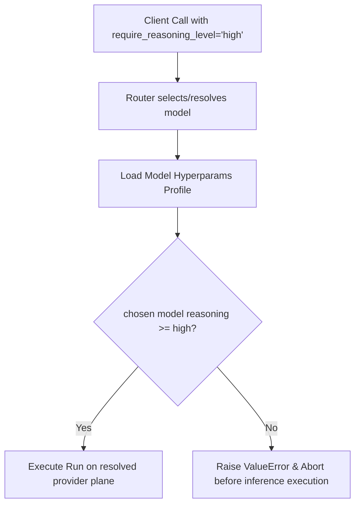

# Reasoning Guard & Level Enforcement

UniGrok's trusted stdio tool set includes a model-profile **Reasoning Guard**
for callers that explicitly request a minimum reasoning effort.

> **Surface scope:** stable HTTP `agent` at `:4765/mcp` does not accept
> `require_reasoning_level`. Use its `mode`, optional model pin, `plane`, and
> `fallback_policy` fields. The guard described below belongs to the full
> trusted stdio `agent` and `chat` signatures. Contributor Forge does not add a
> second public agent signature.

## Guard Mechanism

When calling the trusted stdio `agent` or `chat` tools, clients can pass `require_reasoning_level`.
The gateway performs a pre-execution lookup against the resolved model's
configuration profile (from `.grok/hyperparams`). If the chosen model's
reasoning effort profile is below the requested threshold, the gateway throws
a `ValueError` before inference execution. Model-catalog discovery may already
have contacted a provider, so this is not a guarantee of zero provider traffic.
It does prevent the requested inference turn and its associated generation
cost on an inadequate fallback model.

**Current limitation:** the bundled profiles do not declare
`reasoning_effort`. The loader therefore normalizes every current profile to
`none`. A trusted-stdio request requiring `low`, `medium`, or `high` currently
fails closed for every bundled model. A model name, `thinking_mode`, or the
word `reasoning` in a profile filename does not establish an effort level.

## Reasoning Level Weights
Intelligence levels are graded on a strict threshold hierarchy:

| Level | Weight | Meaning |
|---|---|---|
| `none` | 0 | No minimum profile effort required |
| `low` | 1 | Requires an explicit profile declaration of `low` or higher |
| `medium` | 2 | Requires an explicit profile declaration of `medium` or higher |
| `high` | 3 | Requires an explicit profile declaration of `high` |

## Enforcement Flow Example



## Python Example (Direct Call)
```python
try:
    res = await agent(
        task="Write a compiler in assembly.",
        require_reasoning_level="low"
    )
except ValueError as e:
    print(f"Aborted: {e}")
```

The Control Center's WebMCP `simulate_reasoning_guard` helper is a static
inspection of this release's bundled profile state: every listed model reports
`none`/undeclared. It does not invoke the router and is not evidence that the
stable HTTP MCP tool accepts this field.
