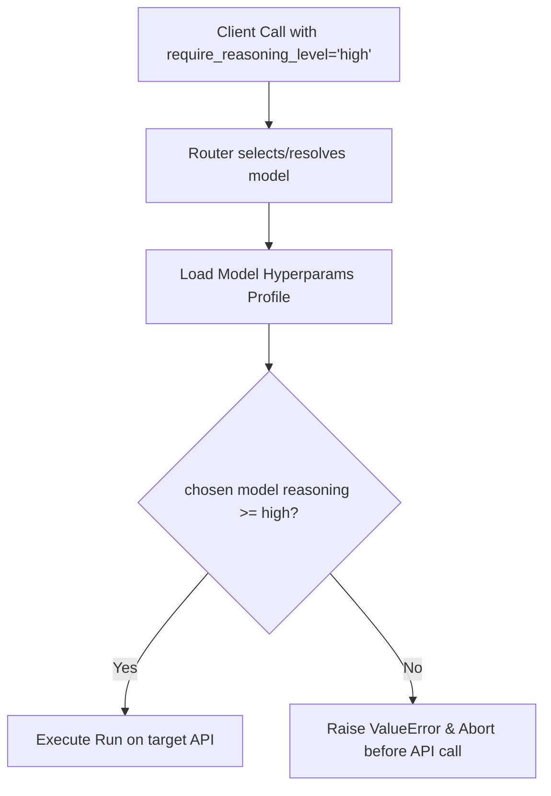

# Reasoning Guard & Level Enforcement

UniGrok includes a model-level **Reasoning Guard** to prevent critical requests from degrading to low-intelligence fallback models during periods of high failover rates or configuration errors.

## Guard Mechanism

When calling the `agent` or `chat` tools, clients can pass `require_reasoning_level`.
The gateway performs a pre-execution lookup against the resolved model's configuration profile (from `.grok/hyperparams`). If the chosen model's reasoning effort profile is below the requested threshold, the gateway throws a `ValueError` immediately *before* making the remote API request. This prevents unnecessary cost and latency on an inadequate fallback model.

## Reasoning Level Weights
Intelligence levels are graded on a strict threshold hierarchy:

| Level | Weight | Description | Typical Target Models |
|---|---|---|---|
| `none` | 0 | Fast toolless completions / lightweight utilities | `grok-build-0.1` |
| `low` | 1 | Standard reasoning with low reflection cycles | Standard API completion fallback profiles |
| `medium` | 2 | Moderate reasoning limits (e.g. debugging/refactoring) | `grok-4.3` |
| `high` | 3 | Full cognitive plane execution / planning loops | `grok-4.5`, `grok-4.20-multi-agent` |

## Enforcement Flow Example



## Python Example (Direct Call)
```python
try:
    res = await agent(
        task="Write a compiler in assembly.",
        require_reasoning_level="high"
    )
except ValueError as e:
    print(f"Aborted: {e}")
```
