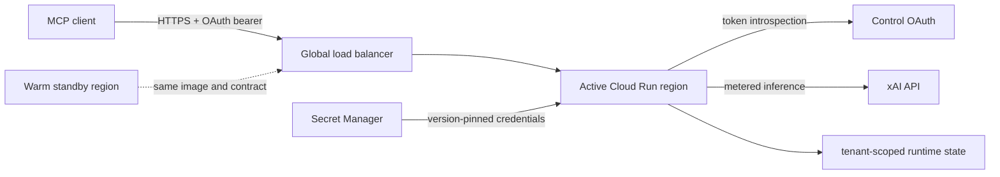

# Authenticated remote MCP deployment

`https://mcp.grokmcp.org/mcp` is the owner-operated UniGrok Cloud Run resource
for approved collaborators and cloud agents. It is reachable from the public
internet, but it is not anonymous: Control OAuth authorizes every protected MCP
request and the gateway checks the required capability scope before dispatch.

This is a deployment runbook for operators. Most users should run the local
Compose service described in the [README](../README.md).

## Architecture



The load balancer terminates public TLS. The gateway itself owns the OAuth,
scope, origin, request-size, tenant, provider-credential, and spend boundaries.
The active and standby services run the same digest; only the active region is
attached to the public backend.

## Local and hosted modes are deliberately different

| | Local Docker / Compose | Cloud Run (`UNIGROK_RUNTIME=cloudrun`) |
| --- | --- | --- |
| Image | Repository `Dockerfile` | Same image, deployed by immutable digest |
| Client boundary | Loopback by default | HTTPS plus Control OAuth introspection |
| Grok Build CLI | Optional OAuth volume | Disabled by policy |
| xAI API | Optional local `.env` key | Secret Manager owner key, with optional principal-bound keys |
| MCP transport | Process-local session support | Stateless HTTP transport |
| SQLite | Persistent Docker volume | Instance-local state directory unless a shared store is added |
| xAI file account | Local owner credential | File tools require a principal-bound provider credential |
| Workspace / Git | Never attached | Never attached |

Do not expose the local Compose port directly to a LAN or the internet. Cloud
mode is the reviewed remote boundary; it is not enabled by changing only the
bind address.

## OAuth contract

The gateway publishes RFC 9728 protected-resource metadata and WebMCP discovery
without authentication. `/healthz` and `/readyz` are also public process gates. Other
remote routes require a bearer token that Control introspection reports as
active, issued for the exact MCP resource, and carrying every required scope.

| Scope | Surface |
| --- | --- |
| `unigrok:connect` | MCP initialization and `agent_result` polling |
| `unigrok:invoke` | General MCP tool execution |
| `unigrok:review` | `review_pull_request` |
| `unigrok:status` | Discovery, status, model, and benchmark tools |
| `unigrok:chat` | Reserved for an authenticated chat-compatible HTTP surface; no `/v1` route ships in this core |

For MCP POSTs, the gateway authenticates `unigrok:connect` before buffering the
request body, applies the bounded body limit, then derives and checks the exact
tool scope. OAuth identity, not `X-Client-ID` or `X-Caller`, owns tenant state,
job polling, telemetry attribution, and any configured daily budget.

An OAuth-capable MCP client should be configured with only the resource URL. It
discovers Control, dynamically registers, uses authorization code plus PKCE,
and opens the user authorization flow. Never put an xAI API key or the Control
token-signing secret in client configuration.

## Runtime contract

Deploy the repository image to a dedicated service and set:

| Variable | Production value or purpose |
| --- | --- |
| `UNIGROK_RUNTIME` | `cloudrun` |
| `UNIGROK_PUBLIC_MCP_URL` | Canonical HTTPS resource ending in `/mcp` |
| `UNIGROK_OAUTH_AUTHORIZATION_SERVERS` | Comma-separated, reviewed HTTPS issuer origins |
| `UNIGROK_OAUTH_INTROSPECTION_URL` | Control HTTPS introspection endpoint |
| `UNIGROK_OAUTH_SCOPES` | Advertised scopes; must include connect, invoke, review, and status |
| `UNIGROK_ALLOWED_ORIGINS` | Optional exact browser origins; omit when no browser client is approved |
| `UNIGROK_REMOTE_BODY_MAX_BYTES` | Optional MCP body cap; defaults to 28 MB and clamps to 64 KB-32 MB |
| `UNIGROK_CALLER_BUDGETS` | Optional JSON daily USD stop thresholds keyed by full canonical OAuth principal |
| `UNIGROK_BREAKER_FAILURES` / `UNIGROK_BREAKER_COOLDOWN` | Optional provider breaker threshold/cooldown; defaults 3 failures / 30 seconds |
| `UNIGROK_STATE_DIR` | `/tmp/unigrok` for the current instance-local deployment |
| `XAI_API_KEY` | Owner-default xAI credential from a version-pinned secret |
| `UNIGROK_PRINCIPAL_XAI_KEYS_JSON` | Optional secret JSON map from canonical OAuth principal to xAI key |

Cloud startup fails closed if the public resource, issuer, introspection URL,
required scopes, principal-key map, or caller-budget map is invalid. Provider
keys are never accepted as gateway bearer credentials and are never returned by
status, discovery, model lists, logs, errors, or receipts.

### Principal credentials and budgets

The optional principal key map is a Secret Manager value, never a checked-in
file. Its keys use the full issuer-bound principal form:

```json
{
  "oauth:https%3A%2F%2Fcontrol.example:github%3A123456": "xai-user-key"
}
```

Rules:

- The decoded issuer must exactly match a configured authorization server.
- Duplicate, malformed, oversized, foreign-issuer, or empty entries reject the
  entire configuration at startup.
- A valid map with no entry for the caller uses the owner-default credential for
  inference.
- Hosted xAI file operations, including `chat_with_files`, are stricter: they
  require a principal-bound credential so one caller cannot see the owner's or
  another caller's provider file account.
- Client caches and circuit breakers are separated by credential generation.
  Rotation requires a new secret version and a new Cloud Run revision.
- `UNIGROK_CALLER_BUDGETS` uses the same exact canonical principal keys. An
  omitted caller retains unbounded compatibility behavior; a configured caller
  is denied if its cost ledger cannot be evaluated safely. The check happens
  before a provider call, so one admitted call or concurrent in-flight calls can
  finish above the threshold. It is not an atomic reservation or provider-side
  hard cap.

## State and scaling limit

OAuth tenants receive separate session, fact, job-owner, and telemetry
namespaces. That is an access-control boundary, not shared storage. The current
Cloud Run configuration uses SQLite under `/tmp`, so state is local to one
instance and does not survive instance replacement.

Consequences:

- Do not claim cross-instance durability for hosted jobs, sessions, or facts.
- Avoid fractional revision canaries: a poll can land on a revision that does
  not own the job. Cut over one functionally verified revision atomically.
- Keep concurrency and scaling conservative until a shared transactional store
  or explicit job-affinity layer exists.
- A `lost` or not-found poll after instance replacement is an honest unknown
  outcome; do not duplicate a metered or mutating request blindly.

Local Compose durability is different: its SQLite volume survives container
restarts as documented in the technical reference.

## Release gate

1. Freeze a clean source commit. Run the full test suite, Ruff, Compose config,
   and an amd64 image build.
2. Push once and resolve the registry digest. From this point onward, deploy the
   digest rather than a mutable tag.
3. Test that exact digest in cloud mode with candidate secret versions. Require
   `/readyz` and an authenticated `scripts/smoke_mcp.py --invoke-api` call; a
   health-only test does not prove provider credentials.
4. Create zero-traffic revisions in active and standby regions. Diff their
   functional configuration against the rollback revision; only reviewed image,
   secret-version, and release-identity fields may change.
5. Keep the standby out of the public backend. Move the active service directly
   to 100% new-revision traffic under an automatic rollback trap.
6. Through the public hostname require:
   - `/healthz` and `/readyz` return `200`;
   - unauthenticated `/mcp` returns `401`;
   - protected-resource and authorization-server metadata return `200`;
   - `X-UniGrok-Revision` identifies the candidate and `source_fingerprint` matches the
     tested image;
   - OAuth initialization, all-tools discovery, destructive-action rejection,
     and a real API invocation succeed.
7. Run a bounded latency soak and inspect candidate logs for errors and 5xx
   responses. Confirm IAM, load-balancer, security-policy, and DNS configuration
   did not drift.
8. Only after the active region passes, move the warm standby to the same digest
   and secret versions. Retain the old revisions for rollback.

## Rollback

Rollback moves 100% service traffic to the known previous revision. Do not
rebuild old source and do not overwrite the candidate secret version. After the
rollback, verify the public hostname rather than trusting only the control-plane
operation.

For regional recovery, stage and verify the replacement service first, then use
one validated URL-map change to repoint every route that selects the old
backend. Keep the previous backend, serverless NEG, service, and revision until
the replacement has passed the public observation window. Removing them is
cleanup, not part of cutover.
